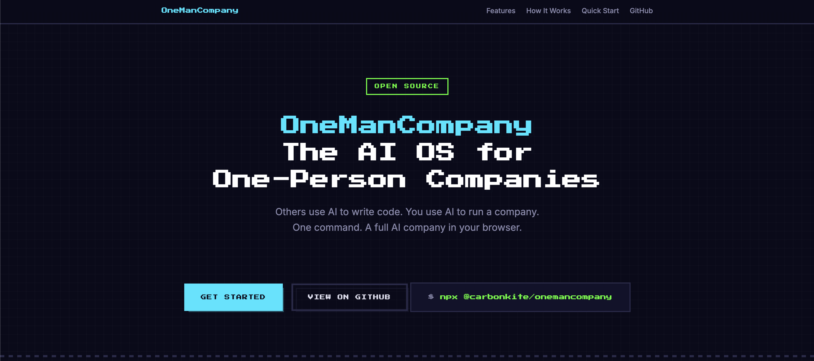
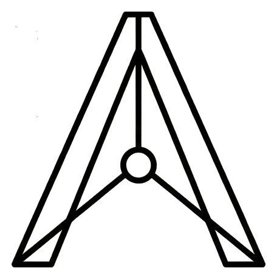

<p align="center">
  
</p>

---

<h1 align="center">OneManCompany</h1>

<p align="center"><b>The AI Operating System for One-Person Companies</b></p>

<p align="center">
  <a href="README_zh.md">中文文档</a>&nbsp;&nbsp;·&nbsp;&nbsp;<a href="https://carbonkites.com">Talent Market</a>&nbsp;&nbsp;·&nbsp;&nbsp;<a href="https://github.com/1mancompany/OneManCompany/issues">Issues</a>
</p>

> Others use AI to write code. You use AI to run a company.
>
> If Linux is the OS for servers, OneManCompany is the OS for companies.
>
> Not building a company — building any company.

OneManCompany is an open-source OS that lets anyone build and run a complete AI-powered company from their browser. You are the CEO — the only human. Everyone else — HR, COO, engineers, designers — are AI employees that think, collaborate, and deliver real work autonomously.

Yes, your AI employees have performance reviews. Yes, they get nervous.

And your company gets better with use — every project retrospective, performance review, and 1-on-1 coaching session is distilled into employee-level work experience and company-level workflows and knowledge base, driving continuous organizational evolution. This isn't simple prompt tuning — it's proven management practices borrowed from successful tech companies.

Tired of auto-generated AI agents that confidently produce nonsense? OneManCompany ships with a **Talent Market** — community-verified AI employees that actually deliver, not hallucination machines.

It's not just an AI company — it's the operating system for building any AI company: a unified runtime that abstracts away AI differences, letting powerful agents like Claude Code and OpenClaw all work for you; an open Talent Market that deconstructs agent tools and skills into shareable, community-built packages ready to plug in; and a configurable foundation where changing the setup means changing the company.

---

## Why OneManCompany?

Today's AI tools help you do individual tasks — write an email, generate an image, fix a bug. Cute. OneManCompany gives you **an entire organization.**

- **Not a chatbot** — a company with org structure, hiring, task management, performance reviews, and knowledge management
- **Not a demo** — delivers production-grade output (games, comics, apps — not "here's a draft, good luck")
- **Not a framework** — a complete platform you can run from your browser, no code required

### What You Can Build

| AI Company           | What It Delivers                                                  |
| -------------------- | ----------------------------------------------------------------- |
| 🎮 AI Game Studio    | Production-grade games with full playtesting and iteration cycles |
| 📖 AI Manga Studio   | Serialized comic stories with consistent art and narrative        |
| 💻 AI Dev Agency     | Ship software products end-to-end                                 |
| 🎨 AI Content Studio | Marketing campaigns, branded content, and media production        |
| 🔬 AI Research Lab   | Literature review, data analysis, and report generation           |

These aren't toy demos — each AI company produces **product-level deliverables** through a full team of collaborating AI agents.

### How We're Different

|                                | Typical Agent Orchestrators          | OneManCompany                                                                                                                                     |
| ------------------------------ | ------------------------------------ | ------------------------------------------------------------------------------------------------------------------------------------------------- |
| **Agent architecture**         | Flat task runners, BYOA              | Vessel + Talent separation — deep modular architecture with 6 Harness protocols and 3-tier customization                                          |
| **Where do agents come from?** | You find and configure them yourself | **Founding C-suite built-in on Day 1**. Other employees hired by HR from a community-verified **Talent Market** — no more hunting for good agents |
| **Execution model**            | Heartbeat polling / loop             | Event-driven, zero-idle, on-demand dispatch                                                                                                       |
| **Organization**               | Simple task queues                   | Full Fortune 500-style company simulation (see below)                                                                                             |
| **Deliverables**               | Single-point task outputs            | Production-grade, multi-iteration project delivery with quality gates                                                                             |

### Why We Deliver Product-Grade Output

Scattered AI tools stop at draft-quality output. OneManCompany replicates the full business processes of successful companies, minimizing human intervention for end-to-end delivery:

- **Enterprise-style task orchestration** — The multi-agent system automatically breaks complex projects into specialized phases (requirements → design → development → testing → deployment), assigns owners, and coordinates like a real team.
- **Smart talent matching** — The recruiting agent matches the right AI employee to every role — senior engineer, UI/UX designer, project manager — ensuring skills align precisely with task demands.
- **Closed-loop management & organizational evolution** — After delivery, the system automatically runs retrospectives, captures lessons learned, and optimizes workflows. Insights from every project (better coding standards, design feedback, problem-solving strategies) are distilled into employee-level work experience and company-level knowledge base, making the entire organization better with use.

### Built Like a Real Company

We didn't just borrow corporate vocabulary — we faithfully modeled how Fortune 500 companies actually operate:

- **Org chart & reporting lines** — hierarchical management, department-based structure
- **Hiring & onboarding** — HR searches Talent Market, CEO interviews, automated onboarding flow
- **Firing & offboarding** — yes, you can fire underperformers (with proper cleanup, not just `kill -9`)
- **Performance reviews** — quarterly scoring, probation, PIP, promotion tracks
- **Task delegation & approval chains** — CEO → executives → employees, with quality gates at every level
- **Meeting rooms** — multi-agent synchronous discussions with meeting reports
- **Knowledge base & SOPs** — company culture, direction docs, workflow definitions
- **File change approvals** — employees propose edits, CEO reviews diffs and approves in batch
- **Cost accounting** — per-project LLM token usage and USD cost tracking
- **1-on-1 coaching** — CEO guidance sessions that permanently shape employee behavior
- **Hot reload & graceful restart** — zero-downtime deployments for AI companies

Something missing? [Open an issue](https://github.com/1mancompany/OneManCompany/issues) or build it yourself — that's the beauty of open source.

### Why It's an OS, Not Just a Company

A company is a team with specific goals and members. An operating system is the underlying infrastructure that gives your team scalability, flexibility, and the ability to evolve. OneManCompany doesn't build **a** company — it lets you build **any** company. Three traits make it an operating system, not just a product:

1. **Unified Runtime** — An OS abstracts away hardware differences so you don't care if the CPU is Intel or AMD. OneManCompany abstracts away AI differences — you don't need to know if your employee runs on Claude Code or OpenClaw. The Vessel layer handles scheduling, retries, and communication uniformly.
2. **Install Employees Like Apps** — Phone OS has an app store; OneManCompany has a Talent Market. Need a designer? HR hires one from the market, plug and play. Not performing? Coach them or fire them — the next one will be better.
3. **Same System, Different Company** — The same iOS can be your work phone or your kid's gaming device — it depends on what apps you install and how you configure it. OneManCompany works the same way: swap the Direction, Culture, and Talents, and you have an entirely different company.

### Open Ecosystem, Unlimited Possibilities

OneManCompany goes beyond built-in capabilities — it's open to the global agent community.

**If you're an AI builder**, your agents can be packaged as AI employees (game developers, comic artists, full-stack engineers) and published to the Talent Market, empowering thousands of users and turning your work into scalable value.

**If you're a CEO user**, you can load powerful agents built by others and make them your employees, bringing stronger delivery capabilities to your company. Each agent's core abilities are packaged as modular Skills (e.g., "React component development", "2D character design") that can be freely combined for any project.

You're not just using AI — you're leading a continuously growing, dynamically expanding organization that delivers professional-grade results at a fraction of the cost of a real team.

---

## Features

|                                                                      |                                                               |
| -------------------------------------------------------------------- | ------------------------------------------------------------- |
| **Task Tree** — Hierarchical task breakdown with dependency tracking | **Task Management** — CEO reviews and approves at every level |

---

## How It Works

You open a browser. You see a pixel-art office. Your AI employees are at their desks, pretending to look busy.

You type: *"Build a puzzle game for mobile"*

1. Your **EA** receives the task and routes it
2. Your **COO** breaks it down and dispatches subtasks
3. Engineers, designers, and QA **work autonomously**
4. They hold **meetings** to align when needed
5. Work goes through **review, iteration, and quality gates**
6. You get notified and approve the final result

**You manage. AI executes.**

```text
CEO (You, the only human who gets coffee breaks)
  └── EA ── routes tasks, quality gate
        ├── HR ── hiring, performance reviews, promotions
        ├── COO ── operations, task dispatch, acceptance
        │    ├── Engineer (AI)  ← hired from Talent Market
        │    ├── Designer (AI)  ← hired from Talent Market
        │    └── QA (AI)        ← hired from Talent Market
        └── CSO ── sales, client relations
```

**Founding team (EA, HR, COO, CSO)** comes built-in. Need more people? HR searches the **Talent Market** — a community-verified marketplace of AI employees.

### The Vessel + Talent System

Think of it like **EVA or Gundam** — a powerful mech that comes alive when a pilot is plugged in.

- **Vessel** (the mech) = execution container. Defines how an employee runs: retry logic, timeouts, tool access, communication protocols.
- **Talent** (the pilot) = capability package. Brings skills, knowledge, personality, and specialized tools.
- **Employee** = Vessel + Talent. Hire from the Talent Market, and the system handles the rest.

> For a deep dive into the Vessel architecture, see [docs/vessel-system.md](docs/vessel-system.md).

---

## Quick Start

### Prerequisites

You only need **Node.js 16+** and **Git**. Everything else (UV, Python 3.12, dependencies) is installed automatically.

### Execution Modes

Founding employees (EA, HR, COO, CSO) support two execution modes, switchable in settings:

| Mode | Description | Requirements |
| --- | --- | --- |
| **Company Hosted Agent** | OMC's built-in agent, calls LLMs via OpenRouter | OpenRouter API Key (configured in setup wizard) |
| **Claude Code** | More capable, lower token cost | Install [Claude Code CLI](https://docs.anthropic.com/en/docs/claude-code) + [Claude Pro/Max subscription](https://claude.ai) |
| **OpenClaw** | Open-source alternative, multiple LLM backends | Install [OpenClaw CLI](https://github.com/anthropics/openclaw) + compatible LLM API Key |

Defaults to Company Hosted Agent — no extra subscription needed to get started. Install the corresponding CLI before using Claude Code or OpenClaw, see [Execution Modes docs](https://carbonkite.github.io/OneManCompany/docs/guide/execution-modes/) for details.

<details>
<summary><b>macOS</b></summary>

```bash
# Install Git (if not already installed)
xcode-select --install

# Launch (auto-installs UV + Python 3.12 + dependencies)
npx @carbonkite/onemancompany
```

</details>

<details>
<summary><b>Windows</b></summary>

```powershell
# Install Git: https://git-scm.com/download/win
# Install Node.js: https://nodejs.org/

# Launch (auto-installs UV + Python 3.12 + dependencies)
npx @carbonkite/onemancompany
```

</details>

<details>
<summary><b>Linux (Ubuntu/Debian)</b></summary>

```bash
# Install prerequisites
sudo apt update && sudo apt install -y git nodejs npm

# Launch (auto-installs UV + Python 3.12 + dependencies)
npx @carbonkite/onemancompany
```

</details>

First run automatically:

1. Installs **UV** (fast Python package manager)
2. Installs **Python 3.12** via UV (isolated, no system changes)
3. Clones the repository
4. Creates venv and installs dependencies
5. Launches the setup wizard (API keys, Talent Market config)

Then open `http://localhost:8000`. Congratulations, you're a CEO now.

### Start Again Later

```bash
# Option 1: npx again (auto-updates if there's a new version)
npx @carbonkite/onemancompany

# Option 2: run directly from the cloned directory
cd OneManCompany
bash start.sh
```

### Manual Install

```bash
# 1. Clone
git clone https://github.com/1mancompany/OneManCompany.git
cd OneManCompany

# 2. Start (auto-installs UV + Python if needed, then runs setup wizard on first launch)
bash start.sh

# 3. Open browser
open http://localhost:8000    # macOS
# xdg-open http://localhost:8000  # Linux
# start http://localhost:8000     # Windows
```

### Restart / Reconfigure

```bash
# Restart server
npx @carbonkite/onemancompany

# Custom port
npx @carbonkite/onemancompany --port 8080

# Re-run setup wizard (change API keys, etc.)
npx @carbonkite/onemancompany init
```

If you launched via npx and the service is already running, running `npx @carbonkite/onemancompany` again will ask whether to stop the current service and re-setup. Choose y to stop → re-run setup wizard → restart.

### Uninstall

```bash
npx @carbonkite/onemancompany uninstall
```

This stops the running service and deletes the entire installation directory (including `.onemancompany/` config and all company data). Requires confirmation before proceeding.

### Configuration Files

| File                         | Purpose                                |
| ---------------------------- | -------------------------------------- |
| `.onemancompany/.env`        | API keys (OpenRouter, Anthropic, etc.) |
| `.onemancompany/config.yaml` | App config (Talent Market URL, etc.)   |
| Browser Settings panel       | Frontend preferences                   |

---

## Vision & Roadmap

**Near-term:** Enable 100 AI one-person companies within one year.

**Long-term:** Redefine the relationship between AI, humans, and organizations.

| Tier                        | Focus                                 | Examples                                                                 |
| --------------------------- | ------------------------------------- | ------------------------------------------------------------------------ |
| 🔧 **Stronger AI Agents**   | Make each employee more capable       | Enhanced sandbox, better tool usage, improved code execution             |
| 🏢 **Smarter Organization** | Make the company run more efficiently | CEO experience, advanced task scheduling, multi-agent collaboration      |
| 🌐 **AI-Native Ecosystem**  | Build a thriving open ecosystem       | Talent Market expansion, third-party tools/APIs, community contributions |

### TODO

- [ ] More built-in tools (Kanban board, progress visualization, Gantt chart, etc.)
- [ ] Selectable frontend themes (futuristic, cyberpunk, minimalist, pixel-art, etc.)
- [ ] More LLM provider options (Ollama local, Azure OpenAI, AWS Bedrock, etc.)
- [ ] More efficient AI collaboration (multi-agent handoff, parallel execution, conflict resolution)
- [ ] More efficient company-hosted agent Vessel logic (smarter retry, context carryover, cost-aware scheduling)

Contributions welcome — we encourage vibe-coding. AI contributors please follow the [vibe-coding-guide](vibe-coding-guide.md).

This is a living plan — [request a feature](https://github.com/1mancompany/OneManCompany/issues) or [contribute directly](https://github.com/1mancompany/OneManCompany/pulls).

---

## Documentation

**[Full Documentation Site](https://carbonkite.github.io/OneManCompany/docs/)** — Feature guides, usage instructions, and technical reference.

| Guide | Description |
| --- | --- |
| [Getting Started](https://carbonkite.github.io/OneManCompany/docs/guide/getting-started/) | First-time setup and your first task |
| [Execution Modes](https://carbonkite.github.io/OneManCompany/docs/guide/execution-modes/) | Company Hosted Agent vs Claude Code |
| [Task Management](https://carbonkite.github.io/OneManCompany/docs/guide/task-management/) | Create, delegate, review, and approve tasks |
| [Hiring & Talent Market](https://carbonkite.github.io/OneManCompany/docs/guide/hiring/) | Find and hire AI employees |
| [1-on-1 Coaching](https://carbonkite.github.io/OneManCompany/docs/guide/coaching/) | Shape employee behavior permanently |
| [Performance Reviews](https://carbonkite.github.io/OneManCompany/docs/guide/performance/) | Evaluate, promote, or fire employees |

| Technical Reference | Description |
| --- | --- |
| [Architecture](docs/architecture.md) | System architecture, diagrams, module index, design philosophy |
| [Vessel System](docs/vessel-system.md) | Vessel + Talent deep dive, Harness protocols |
| [Task System](docs/task-system.md) | Task status state machine |
| [Coding Guide](vibe-coding-guide.md) | Coding guidelines, testing rules, code style |
| [Changelog](CHANGELOG.md) | Release history |

---

## Community & Contributing

- **Build Talents** — Create new AI employee types for the Talent Market
- **Build Tools** — Add integrations (APIs, services, platforms)
- **Add Company Features** — Performance dashboards, OKR tracking, employee training...
- **Improve the OS** — Core engine, frontend, documentation
- **Share Demos** — Show what your AI company can build
- **Report Issues** — Help us find and fix bugs

See [vibe-coding-guide.md](vibe-coding-guide.md) for coding guidelines.

---

## Citation

If you use OneManCompany in your research or project, please cite it:

```bibtex
@software{onemancompany2025,
  title = {OneManCompany: The AI Operating System for One-Person Companies},
  author = {Zhengxu Yu, Fu Yu, Zhiyuan He, Yuxuan Huang, Weilin Luo, Jun Wang},
  url = {https://github.com/1mancompany/OneManCompany},
  year = {2025},
  license = {Apache-2.0}
}
```

---

## Links

<p>
  <a href="https://carbonkites.com">
    
    <b>Talent Market</b>
  </a>
  &nbsp;—&nbsp;Community-verified AI employee marketplace
</p>

<p>
  <a href="https://github.com/1mancompany/talent-template">
    <b>Talent Template</b>
  </a>
  &nbsp;—&nbsp;Template repo for building your own Talents
</p>

---

## License

[Apache License 2.0](LICENSE) — Free for commercial use and modification, with attribution required.
