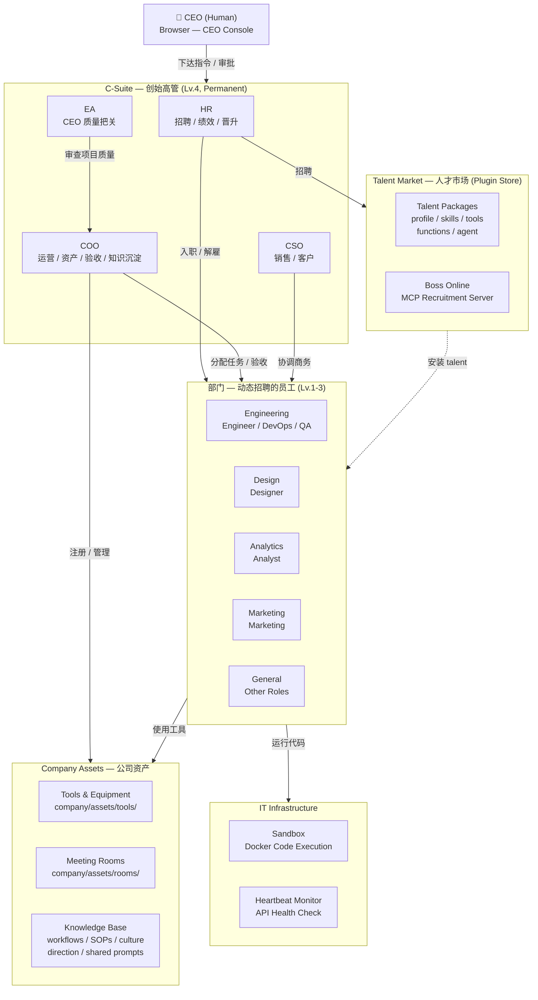
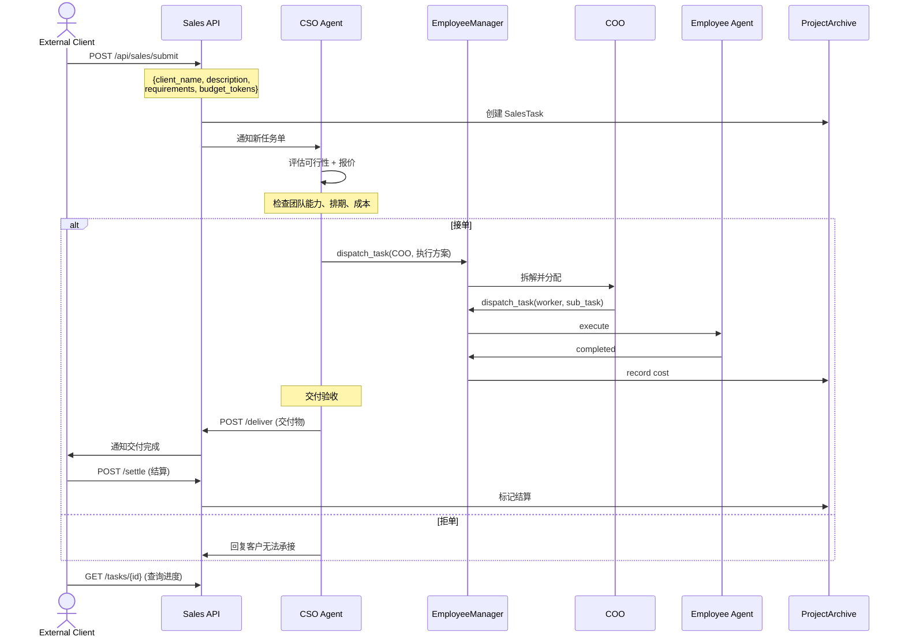
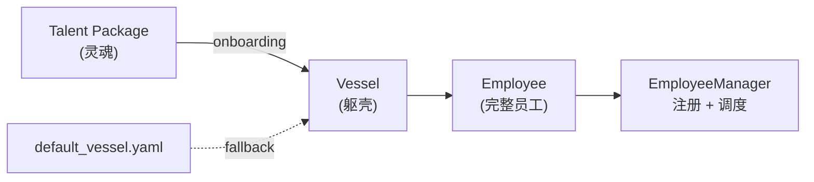

# OneManCompany

**AI 公司框架 + 运营平台** — 一个人用 AI 运转一整家公司。

OneManCompany 不仅仅是一个 multi-agent 框架——它是一套**以公司组织为核心隐喻的 AI agent 运营平台**。你是 CEO（唯一的人类），在浏览器里经营一家拥有完整组织架构的公司：招聘、入职、任务分配、项目管理、验收、绩效考核，全部由 AI 高管和员工自主执行。

**核心定位**：

- **框架**：提供 Vessel（躯壳）+ Talent（灵魂）的 agent 抽象、Harness 套接件标准、可插拔执行后端
- **平台**：开箱即用的像素风办公室 UI、CEO Console、实时 WebSocket 推送、项目全生命周期管理

---

## Design Philosophy — 设计哲学

- **公司即系统** — 不是在写一个"多 agent 框架"，而是在建一家真实运转的公司。组织架构、汇报关系、入职离职、绩效考核，都是一等公民。
- **Vessel + Talent = Employee** — 躯壳（执行容器）与灵魂（能力包）分离。同一个躯壳可以注入不同灵魂，同一个灵魂可以装进不同躯壳。员工是两者结合的产物。
- **DNA 驱动** — 每个员工的行为由 `vessel.yaml` 定义：重试策略、超时、上下文注入、能力声明。不写代码也能调整员工特性。
- **套接件标准（Harness）** — 执行、任务、事件、存储、上下文、生命周期，六类 Protocol 定义了躯壳与公司系统的全部连接点。替换任意一个不影响其余。
- **Talent Market = 插件商店** — 招人就是装插件。一个 talent 包自带 profile、skills、tools、vessel config，HR 一键入职即可上岗。
- **CEO 是唯一的人** — 系统的全部设计围绕"一个人管一家公司"展开。AI 不是辅助工具，而是真正的员工。
- **零空转** — 没有 while-True 轮询。所有任务 on-demand 推送，事件驱动，按需执行。
- **Git-friendly 持久化** — YAML + Markdown + JSON，无数据库依赖。公司状态可以 git diff、git blame、git revert。

---

## 1. Company Overview — 公司全景

> 把系统当成一家真实运转的公司来看：CEO 是唯一的真人，其余全部由 AI Agent 驱动。




**运转模式**：CEO 在浏览器输入任务 → 系统路由到对应高管 → 高管拆解并 `dispatch_task()` 给合适员工 → 员工执行 → 高管验收 → EA 复核 → 项目归档。

---

## 2. Module Architecture — 技术模块

> 从代码视角看各层模块如何连接。纵向是调用链，横向是同层协作。

```mermaid
graph TB
    subgraph Presentation["表现层 — Frontend"]
        HTML["index.html<br>3-Column Layout"]
        OfficeJS["office.js<br>Canvas 2D Pixel Art"]
        AppJS["app.js<br>CEO Console + WS Client"]
    end

    subgraph Gateway["网关层 — FastAPI"]
        REST["routes.py<br>/task /hire /fire /state<br>/talents /projects"]
        WSS["websocket.py<br>/ws Real-time Push"]
    end

    subgraph AgentLayer["Agent 层 — LangChain Agents"]
        direction TB
        subgraph Runners["Agent Runners"]
            BAR["BaseAgentRunner<br>streaming / prompt / status"]
            EA2["EmployeeAgent<br>通用员工 runner"]
            Custom["Custom Runner<br>talent 自带 runner"]
        end
        subgraph Founding["创始 Agent (专用 prompt + tools)"]
            HRA["HRAgent"]
            COOA["COOAgent"]
            EAA["EAAgent"]
            CSOA["CSOAgent"]
        end
        subgraph AgentInfra["Agent 基础设施"]
            PB["PromptBuilder<br>composable sections"]
            CT["common_tools.py<br>dispatch / meeting<br>list_colleagues / file ops"]
            OB["onboarding.py<br>hire flow + talent install"]
            TM["termination.py<br>fire flow + cleanup"]
        end
    end

    subgraph CoreEngine["核心引擎 — Core"]
        EM["EmployeeManager<br>on-demand task dispatch<br>hooks / history / retry"]
        EB["EventBus<br>async pub/sub"]
        CS["CompanyState<br>singleton + hot-reload"]
        PA["ProjectArchive<br>lifecycle / cost / iteration"]
        RT["routine.py<br>post-task workflows"]
        WE["workflow_engine.py<br>markdown → steps"]
        LY["layout.py<br>office grid allocation"]
        CFG["config.py<br>paths / constants / loaders"]
    end

    subgraph VesselLayer["Vessel 执行层 — 执行后端"]
        LC["LangChainExecutor<br>company-hosted"]
        CL["ClaudeSessionExecutor<br>self-hosted (CLI)"]
        SL["ScriptExecutor<br>bash scripts"]
    end

    subgraph TalentLayer["Talent Market"]
        TS["talent_spec.py<br>TalentPackage<br>AgentManifest"]
        BO["boss_online.py<br>MCP Server"]
        TD["talents/{id}/<br>profile / skills / tools<br>functions / agent"]
    end

    subgraph Persistence["持久层 — company/"]
        EMP["employees/{id}/<br>profile / skills / agent"]
        AST["assets/<br>tools / rooms"]
        BIZ["business/<br>workflows / projects<br>resolutions / reports"]
        CUL["company_culture.yaml<br>company_direction.yaml<br>shared_prompts/"]
    end

    %% Presentation → Gateway
    AppJS -->|"HTTP + WS"| Gateway

    %% Gateway → Core
    REST --> EM
    REST --> CS
    WSS --> EB

    %% Core orchestration
    EM -->|"dispatch"| VesselLayer
    EM --> EB
    EM --> PA
    EB --> WSS
    RT --> WE
    CS --> CFG
    LY --> CS

    %% Executors → Runners
    LC --> BAR
    CL -->|"claude CLI"| EMP
    SL -->|"launch.sh"| EMP

    %% Agent hierarchy
    HRA --> BAR
    COOA --> BAR
    EAA --> BAR
    CSOA --> BAR
    EA2 --> BAR
    Custom --> BAR
    BAR --> PB
    BAR --> CT

    %% Onboarding path
    OB --> TS
    OB --> EM
    OB --> CFG

    %% Data access
    CFG --> Persistence
    COOA --> AST
    PA --> BIZ
```




**关键分层**：

- **表现层**：纯静态前端，零构建工具，Canvas 像素画 + WebSocket 实时推送
- **网关层**：FastAPI REST + WS，负责路由和认证
- **Agent 层**：所有 AI 角色的实现，共享 `BaseAgentRunner` 和 `PromptBuilder`
- **核心引擎**：`EmployeeManager` 统一调度，`EventBus` 事件驱动，`CompanyState` 单例状态
- **Vessel 执行层**：插拔式执行后端（Executor），同一套 Harness 协议支持三种运行模式
- **持久层**：YAML + Markdown + JSON，git-friendly，无数据库依赖

---

## 3. Operating Modes — 运转模式

公司有两种驱动模式，对应不同的任务入口，但共享同一套执行 → 验收 → 归档管线。

### Mode A: CEO 驱动 — 内部经营

> CEO 通过浏览器直接下达指令，高管拆解执行。这是日常经营模式。


### Mode B: 互联网任务单驱动 — 对外接单

> 外部客户通过 Sales API 提交任务单，CSO 接单评估，内部团队执行交付。公司作为服务商运转。




**两种模式对比**：


|         | CEO 驱动                 | 互联网任务单                          |
| ------- | ---------------------- | ------------------------------- |
| **入口**  | CEO Console (Browser)  | Sales API (`/api/sales/submit`) |
| **路由**  | 关键词匹配 → HR / COO / CSO | CSO 统一接单                        |
| **质量门** | 员工自检 → 高管验收 → EA 复核    | CSO 验收 → 交付客户                   |
| **结算**  | 内部 cost tracking       | 客户 budget_tokens 结算             |
| **场景**  | 日常经营、产品开发、内部建设         | 对外接活、SaaS 交付、定制开发               |


**共享的核心管线**：无论哪种模式，底层都走 `EmployeeManager.push_task()` → `Executor.execute()` → `ProjectArchive` 同一条执行链路。

---

## Module Index


| Layer        | Module               | Role                                                                                 |
| ------------ | -------------------- | ------------------------------------------------------------------------------------ |
| **Entry**    | `main.py`            | FastAPI app, lifespan (register agents, sandbox, watchdog, heartbeat)                |
| **API**      | `routes.py`          | REST: `/task`, `/hire`, `/fire`, `/state`, talent market, projects                   |
| **API**      | `websocket.py`       | WS `/ws` — broadcasts EventBus events to frontend                                    |
| **Agents**   | `base.py`            | `BaseAgentRunner` (streaming, prompt building), `EmployeeAgent`                      |
| **Agents**   | `hr_agent.py`        | Hiring, performance review, promotion, quarterly cycle                               |
| **Agents**   | `coo_agent.py`       | Asset management, meeting rooms, project acceptance, knowledge deposit               |
| **Agents**   | `ea_agent.py`        | CEO quality gate — final review before project close                                 |
| **Agents**   | `cso_agent.py`       | Sales pipeline, client outreach                                                      |
| **Agents**   | `common_tools.py`    | `dispatch_task`, `pull_meeting`, `list_colleagues`, file/sandbox ops                 |
| **Agents**   | `prompt_builder.py`  | Named sections with priority, composable prompt system                               |
| **Agents**   | `onboarding.py`      | `execute_hire()`, talent asset install, agent config, hooks                          |
| **Agents**   | `termination.py`     | `execute_fire()`, tool cleanup, layout recompute                                     |
| **Core**     | `config.py`          | All paths, constants, employee/talent config loaders                                 |
| **Core**     | `state.py`           | `CompanyState` singleton, hot-reload, employee/project state                         |
| **Core**     | `events.py`          | Async `EventBus` — pub/sub for all system events                                     |
| **Core**     | `vessel.py`          | `Vessel`(躯壳), `EmployeeManager`, `Executor` protocol, task queue, hooks, history     |
| **Core**     | `vessel_config.py`   | `VesselConfig`(DNA) — load/save/migrate `vessel.yaml` per employee                   |
| **Core**     | `vessel_harness.py`  | Harness protocols(套接件): `ExecutionHarness`, `TaskHarness`, `EventHarness`, etc.      |
| **Core**     | `agent_loop.py`      | Backward-compat shim — re-exports everything from `vessel.py`                        |
| **Core**     | `routine.py`         | Post-task workflow dispatch (project retrospective, etc.)                            |
| **Core**     | `workflow_engine.py` | Parses `company/business/workflows/*.md` → `WorkflowDefinition`                      |
| **Core**     | `project_archive.py` | Project CRUD, iteration tracking, cost recording                                     |
| **Core**     | `layout.py`          | Department-based office grid, desk allocation                                        |
| **Talent**   | `talent_spec.py`     | Dataclasses: `TalentPackage`, `VesselManifest`, `AgentManifest`, `FunctionsManifest` |
| **Talent**   | `boss_online.py`     | MCP server subprocess for recruitment                                                |
| **Infra**    | `tools/sandbox/`     | Docker-based code execution (execute, runcommand, write/read)                        |
| **Infra**    | `claude_session.py`  | Claude Code CLI session management (self-hosted employees)                           |
| **Infra**    | `heartbeat.py`       | Periodic API connectivity check (zero token cost)                                    |
| **Frontend** | `index.html`         | 3-column layout: Office / Console / Details                                          |
| **Frontend** | `office.js`          | Canvas 2D pixel art renderer, sprite system                                          |
| **Frontend** | `app.js`             | CEO console, WebSocket handler, UI state                                             |


## Tech Stack

- **Backend**: Python 3.12+ / UV, FastAPI + WebSocket, LangChain (`create_react_agent`)
- **LLM**: OpenRouter API (configurable per employee), Anthropic API (OAuth/API key)
- **Frontend**: Vanilla JS + Canvas 2D pixel art (no build tools)
- **Infra**: Docker sandbox, MCP server, Watchdog hot-reload
- **Data**: YAML profiles + Markdown workflows + JSON project archives

## Vessel Architecture — 躯壳 · 灵魂 · 套接件

> **哲学**: Vessel（躯壳）+ Talent（灵魂）= Employee（员工）

每个员工由两部分组成：**Vessel** 是执行容器（躯壳），提供运行环境、重试策略、上下文注入等基础设施；**Talent** 是能力包（灵魂），提供技能、提示词、自定义 runner。入职时灵魂注入躯壳，形成完整员工。

### 核心概念

```
employees/00010/
├── profile.yaml          # 员工档案
├── vessel/               # 躯壳 DNA
│   ├── vessel.yaml       # 配置：runner / hooks / limits / capabilities
│   └── prompt_sections/  # 提示词片段
├── skills/               # 灵魂 — 技能
└── progress.log          # 工作记忆
```

**vessel.yaml** — 躯壳的 DNA，定义执行行为：


| 字段             | 说明                                 |
| -------------- | ---------------------------------- |
| `runner`       | 神经系统 — 自定义 runner 模块和类名            |
| `hooks`        | 生命周期钩子 — pre_task / post_task 回调   |
| `context`      | 上下文注入 — prompt sections、进度日志、任务历史  |
| `limits`       | 执行限制 — 重试次数、超时、子任务深度               |
| `capabilities` | 能力声明 — sandbox、文件上传、WebSocket、图片生成 |


### VesselHarness — 套接件标准

6 类 Protocol 定义了 Vessel 与公司系统的连接标准：


| Harness            | 职责                                       |
| ------------------ | ---------------------------------------- |
| `ExecutionHarness` | 执行套接件 — Executor 协议（execute / is_ready）  |
| `TaskHarness`      | 任务套接件 — 任务队列管理（push / get_next / cancel） |
| `EventHarness`     | 事件套接件 — 日志和事件发布                          |
| `StorageHarness`   | 存储套接件 — 进度日志和历史持久化                       |
| `ContextHarness`   | 上下文套接件 — prompt / context 组装             |
| `LifecycleHarness` | 生命周期套接件 — pre/post task 钩子调用             |


### Talent → Employee 转换




安装优先级：talent 自带 `vessel/vessel.yaml` → talent 旧版 `agent/manifest.yaml`（自动转换） → 系统默认 `default_vessel.yaml`

### 向后兼容

所有旧名称通过别名继续可用：


| 旧名                      | 新名                                           |
| ----------------------- | -------------------------------------------- |
| `EmployeeHandle`        | `Vessel`                                     |
| `Launcher`              | `ExecutionHarness`                           |
| `LangChainLauncher`     | `LangChainExecutor`                          |
| `ClaudeSessionLauncher` | `ClaudeSessionExecutor`                      |
| `ScriptLauncher`        | `ScriptExecutor`                             |
| `agent_loop.py`         | `vessel.py`（agent_loop.py 变为 re-export shim） |


---

## Quick Start

```bash
# 1. Install
uv sync

# 2. Configure
cp .env.example .env   # fill OPENROUTER_API_KEY

# 3. Run
uv run onemancompany

# 4. Open
open http://localhost:8000
```

## Key Concepts


| Concept                        | Description                                                                         |
| ------------------------------ | ----------------------------------------------------------------------------------- |
| **Vessel = 躯壳**                | 员工的执行容器，包含 DNA（vessel.yaml）、神经系统（runner）、套接件（harness）                               |
| **Talent = 灵魂**                | `talents/{id}/` 自包含的 agent 包（profile / skills / tools / functions / vessel config）  |
| **Vessel + Talent = Employee** | 躯壳（执行容器）+ 灵魂（能力包）= 完整员工                                                             |
| **VesselConfig = DNA**         | `vessel.yaml` 定义 runner / hooks / context / limits / capabilities                   |
| **VesselHarness = 套接件**        | 6 类 Protocol：Execution / Task / Event / Storage / Context / Lifecycle               |
| **Agent Modularization**       | 三层定制：prompt sections（轻量）→ lifecycle hooks（中等）→ custom runner（完全替换）                  |
| **EmployeeManager**            | 中央调度器，on-demand 推送任务，无空转轮询                                                          |
| **Executor Protocol**          | `LangChainExecutor` / `ClaudeSessionExecutor` / `ScriptExecutor` — 统一接口，三种后端        |
| **EventBus**                   | 所有状态变更 → async pub/sub → WebSocket → 前端实时更新                                         |
| **Knowledge Deposit**          | COO 通过 `deposit_company_knowledge()` 将 workflow / SOP / culture / guidance 沉淀到公司知识库 |


---

## Changelog

<!-- CHANGELOG_START -->
| Date | Commit | Summary |
|------|--------|---------|
| 2026-03-09 | `91ccaee` | Update: task_tree, test_task_tree |
| 2026-03-09 | `9bbea9e` | Update: test_agent_loop, vessel |
| 2026-03-09 | `c8e6451` | Update: __init__, 人员缺口分析报告, 1df8f2de, 2026-03-09-unified-tool-registry, 2026-03-09-unified-tool-registry-design |
| 2026-03-09 | `ea1ef92` | Update: __init__, claude_session, config_builder, godot_research_report, mcp_config |
| 2026-03-09 | `149732a` | Update: heartbeat, manifest, profile, routes, test_heartbeat |
| 2026-03-06 | `0001e37` | Update: .state_snapshot, app, manifest, profile |
| 2026-03-06 | • update: , .state_snapshot, app, base, config |
| 2026-03-05 | `7609eec` | 1808 unit tests covering workflow engine, heartbeat, claude session, and more |
| 2026-03-04 | `bd3125f` | Fix test isolation: fire tests no longer leak offboarding routine side effects |
| 2026-03-04 | `cfb252d` | Persistent meeting reports: pull-meeting auto-generates archived records |
| 2026-03-04 | `9f74231` | GitHub talent one-click import script + system_prompt_template in prompt pipeline |
| 2026-03-04 | `49d4c78` | Full HR lifecycle: probation, PIP, OKR goal management, standardized onboarding/offboarding |
| 2026-03-04 | `e25a50f` | First 976 unit tests + pre-commit test gate + auto-changelog hook |
| 2026-03-04 | `06d0cfb` | Ralph cross-task memory (progress.log), project routing reports, candidate shortlists |
| 2026-03-04 | `2e1111d` | API heartbeat health check (zero token cost) + OAuth login fix |
| 2026-03-04 | `760022c` | Agent modularization: 3-tier customization (prompt sections / hooks / custom runner) + COO knowledge deposit tool |
| 2026-03-04 | `16bc792` | Frontend CEO Console UX improvements |
<!-- CHANGELOG_END -->
