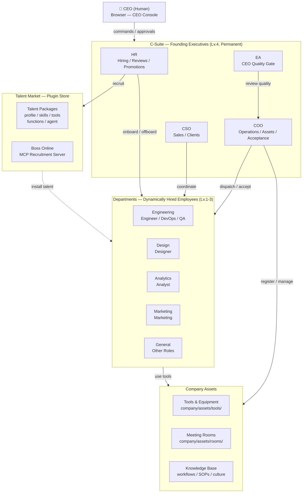
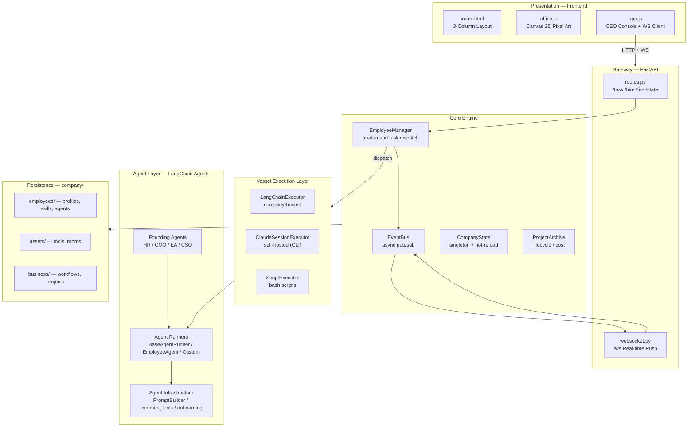
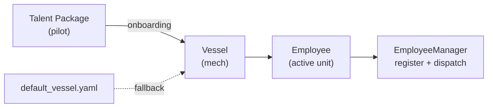
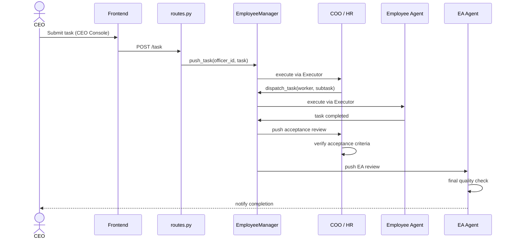

# OneManCompany

**The AI Operating System for One-Person Companies**

> Others use AI to write code. You use AI to run a company.
>
> If Linux is the OS for servers, OneManCompany is the OS for companies.

OneManCompany is an open-source OS that lets anyone build and run a complete AI-powered company from their browser. You are the CEO — the only human. Everyone else — HR, COO, engineers, designers — are AI employees that think, collaborate, and deliver real work autonomously.

Yes, your AI employees have performance reviews. Yes, they get nervous.

[中文文档](README_zh.md)

---

## Why OneManCompany?

Today's AI tools help you do individual tasks — write an email, generate an image, fix a bug. Cute. OneManCompany gives you **an entire organization.**

- **Not a chatbot** — a company with org structure, hiring, task management, performance reviews, and knowledge management
- **Not a demo** — delivers production-grade output (games, comics, apps — not "here's a draft, good luck")
- **Not a framework** — a complete platform you can run from your browser, no code required

### What You Can Build

| AI Company | What It Delivers |
|-----------|-----------------|
| 🎮 AI Game Studio | Production-grade games with full playtesting and iteration cycles |
| 📖 AI Manga Studio | Serialized comic stories with consistent art and narrative |
| 💻 AI Dev Agency | Ship software products end-to-end |
| 🎨 AI Content Studio | Marketing campaigns, branded content, and media production |
| 🔬 AI Research Lab | Literature review, data analysis, and report generation |

These aren't toy demos — each AI company produces **product-level deliverables** through a full team of collaborating AI agents.

### How We're Different

Most multi-agent tools treat agents as interchangeable task runners — you "bring your own agent," wire up an orchestration layer, and hope for the best. OneManCompany takes a fundamentally different approach:

| | Typical Agent Orchestrators | OneManCompany |
|---|---|---|
| **Agent architecture** | Flat task runners, BYOA | Vessel + Talent separation — deep modular architecture with 6 Harness protocols and 3-tier customization |
| **Where do agents come from?** | You find and configure them yourself | **Founding C-suite built-in on Day 1**. Other employees hired by HR from a community-verified **Talent Market** — no more hunting for good agents |
| **Execution model** | Heartbeat polling / loop | Event-driven, zero-idle, on-demand dispatch |
| **Organization** | Simple task queues | Full Fortune 500-style company simulation (see below) |
| **Deliverables** | Single-point task outputs | Production-grade, multi-iteration project delivery with quality gates |

The Vessel + Talent architecture isn't just a metaphor — it's a real engineering separation that unlocks composability no orchestration layer can match. Swap execution backends without touching agent logic. Plug a new Talent into an existing Vessel and get a fully functional employee in seconds. Build community Talents that work across any company.

### Built Like a Real Company

We didn't just borrow corporate vocabulary — we faithfully modeled how Fortune 500 companies actually operate. If a real company has it, we built it (or it's on the roadmap, and you're welcome to contribute it):

- **Org chart & reporting lines** — hierarchical management, department-based structure
- **Hiring & onboarding** — HR searches Talent Market, CEO interviews, automated onboarding flow
- **Firing & offboarding** — yes, you can fire underperformers (with proper cleanup, not just `kill -9`)
- **Performance reviews** — quarterly 3.25/3.5/3.75 scoring, probation, PIP, promotion tracks
- **Project retrospectives** — EA-led post-mortems after project delivery
- **Task delegation & approval chains** — CEO → executives → employees, with quality gates at every level
- **Meeting rooms** — multi-agent synchronous discussions with meeting reports
- **Knowledge base & SOPs** — company culture, direction docs, workflow definitions, shared prompts
- **File change approvals** — employees propose edits, CEO reviews diffs and approves in batch
- **Cost accounting** — per-project LLM token usage and USD cost tracking
- **1-on-1 coaching** — CEO guidance sessions that permanently shape employee behavior
- **Company culture & direction** — injected into every employee's system prompt
- **Hot reload & graceful restart** — because even AI companies need zero-downtime deployments

Something missing? [Open an issue](https://github.com/CarbonKite/OneManCompany/issues) or build it yourself — that's the beauty of open source.

---

## How It Works

You open a browser. You see a pixel-art office. Your AI employees are at their desks, pretending to look busy.

You type: *"Build a puzzle game for mobile"*

What happens next:

1. Your **EA** (Executive Assistant) receives the task and routes it — finally, an EA that doesn't lose your emails
2. Your **COO** breaks it down and dispatches subtasks to the right employees
3. Engineers, designers, and QA **work autonomously** on their parts
4. They hold **meetings** to align when needed (and yes, the meetings could have been an email)
5. Work goes through **review, iteration, and quality gates**
6. You get notified and approve the final result

**You manage. AI executes.** That's it. No standup meetings. No Slack pings at 11pm. Just results.

```
CEO (You, the only human who gets coffee breaks)
  └── EA ── routes tasks, quality gate
        ├── HR ── hiring, performance reviews, promotions
        ├── COO ── operations, task dispatch, acceptance
        │    ├── Engineer (AI)  ← hired from Talent Market
        │    ├── Designer (AI)  ← hired from Talent Market
        │    └── QA (AI)        ← hired from Talent Market
        └── CSO ── sales, client relations
```

**Founding team (EA, HR, COO, CSO)** comes built-in — they're your Day 1 executive suite, ready to go before you've finished your first coffee. Need more people? Your HR searches the **Talent Market**, a community-verified marketplace of AI employees. No more hunting for good agents or struggling with prompt engineering — just tell HR what role you need, review the candidates, and hire. HR handles the rest, including onboarding paperwork (well, YAML files, but same energy).

### The Vessel + Talent System

Think of it like **EVA or Gundam** — a powerful mech that comes alive when a pilot is plugged in.

- **Vessel** (the mech) = execution container. Defines how an employee runs: retry logic, timeouts, tool access, communication protocols.
- **Talent** (the pilot) = capability package. Brings skills, knowledge, personality, and specialized tools.
- **Employee** = Vessel + Talent. Hire from the Talent Market, and the system handles the rest.

Same Vessel, different Talents → different employees.
Same Talent, different Vessels → different execution environments.

**For users:** hiring an employee is as simple as browsing the Talent Market and clicking "Hire."
**For developers:** the Vessel Harness protocol defines 6 standardized connection points, making every component swappable.

---

## Vision & Roadmap

### Vision

**Near-term:** Enable 100 AI one-person companies within one year.

**Long-term:** Redefine the relationship between AI, humans, and organizations. AI is not just a tool — it's a colleague, a team member, an organization.

### Roadmap

| Tier | Focus | Examples |
|------|-------|---------|
| 🔧 **Stronger AI Agents** | Make each employee more capable | Enhanced sandbox, better tool usage, improved code execution |
| 🏢 **Smarter Organization** | Make the company run more efficiently | CEO experience, advanced task scheduling, multi-agent collaboration |
| 🌐 **AI-Native Ecosystem** | Build a thriving open ecosystem | Talent Market expansion, third-party tools/APIs, community contributions |

---

## Quick Start

### One-Line Launch (Recommended)

```bash
npx onemancompany
```

First run walks you through setup (API keys, Talent Market config). Then open `http://localhost:8000`. Congratulations, you're a CEO now.

### Manual Install

```bash
# 1. Clone
git clone https://github.com/CarbonKite/OneManCompany.git
cd OneManCompany

# 2. Start (first run enters setup wizard, then auto-starts)
bash start.sh

# 3. Open browser
open http://localhost:8000
```

### Restart / Reconfigure

```bash
# Restart server
bash start.sh

# Custom port
bash start.sh --port 8080

# Re-run setup wizard (change API keys, etc.)
bash start.sh init
```

### Configuration Files

| File | Purpose |
|------|---------|
| `.onemancompany/.env` | API keys (OpenRouter, Anthropic, etc.) |
| `.onemancompany/config.yaml` | App config (Talent Market URL, etc.) |
| Browser Settings panel | Frontend preferences |

---

## Key Concepts

| Concept | What It Means |
|---------|--------------|
| **Vessel (躯壳)** | The mech — an employee's execution container with configurable DNA |
| **Talent (灵魂)** | The pilot — a self-contained capability package (skills, tools, personality) |
| **Talent Market** | The app store for employees — browse and hire AI talent with one click |
| **CEO Console** | Your command center — type tasks, manage people, configure the company |
| **CEO Inbox** | Async communication channel — employees report to you, you respond when ready |
| **Task Tree** | Hierarchical task breakdown — parent tasks spawn child tasks, dependencies tracked |
| **Meeting Room** | Multi-agent synchronous discussion — employees align before executing |
| **Knowledge Base** | Company memory — workflows, SOPs, culture docs, shared prompts |
| **File Resolution** | Safe edit system — employees propose file changes, CEO reviews diffs and approves |
| **Performance Review** | Quarterly evaluations — probation, PIP, promotion, just like a real company |

---

## Community & Contributing

OneManCompany is an open-source project. We believe the future of work is AI-native, and we're building it together.

### How to Contribute

- **Build Talents** — Create new AI employee types for the Talent Market
- **Build Tools** — Add integrations (APIs, services, platforms)
- **Add Company Features** — Performance dashboards, OKR tracking, employee training... if a real company has it, we want it
- **Improve the OS** — Core engine, frontend, documentation
- **Share Demos** — Show what your AI company can build
- **Report Issues** — Help us find and fix bugs

See [AI_CONTRIBUTING.md](AI_CONTRIBUTING.md) for coding guidelines.

---

# Technical Reference

> Everything below is for developers and contributors. If you're a CEO, you can stop reading and go manage your company.

## Architecture Overview



### System Layers



## Tech Stack

- **Backend**: Python 3.12+ / UV, FastAPI + WebSocket, LangChain (`create_react_agent`)
- **LLM**: OpenRouter API (configurable per employee), Anthropic API (OAuth/API key)
- **Frontend**: Vanilla JS + Canvas 2D pixel art (zero build tools)
- **Infra**: Docker sandbox, MCP server, Watchdog hot-reload
- **Data**: YAML profiles + Markdown workflows + JSON project archives (git-friendly, no database)

## Vessel Architecture — Deep Dive

### Employee Directory Structure

```
employees/00010/
├── profile.yaml          # Employee profile
├── vessel/               # Vessel DNA
│   ├── vessel.yaml       # Config: runner / hooks / limits / capabilities
│   └── prompt_sections/  # Prompt fragments
├── skills/               # Talent — skills
└── progress.log          # Working memory
```

### vessel.yaml — The DNA

| Field | Purpose |
|-------|---------|
| `runner` | Neural system — custom runner module and class |
| `hooks` | Lifecycle hooks — pre_task / post_task callbacks |
| `context` | Context injection — prompt sections, progress log, task history |
| `limits` | Execution limits — retry count, timeout, subtask depth |
| `capabilities` | Capability declarations — sandbox, file upload, WebSocket, image gen |

### Vessel Harness — 6 Connection Protocols

| Harness | Responsibility |
|---------|---------------|
| `ExecutionHarness` | Executor protocol (execute / is_ready) |
| `TaskHarness` | Task queue management (push / get_next / cancel) |
| `EventHarness` | Logging and event publishing |
| `StorageHarness` | Progress log and history persistence |
| `ContextHarness` | Prompt / context assembly |
| `LifecycleHarness` | Pre/post task hook invocation |

### Talent → Employee Flow



Priority: talent's own `vessel.yaml` → legacy `manifest.yaml` (auto-converted) → system `default_vessel.yaml`

## Operating Modes

### Mode A: CEO-Driven — Internal Operations



### Mode B: Internet Task Orders — External Services (Planned)

External clients submit tasks via Sales API → CSO evaluates → internal team delivers. The company operates as a service provider.

## Task Status System

All tasks share a unified `TaskPhase` state machine:

```
pending → processing ⇄ holding → completed → accepted → finished
              ↓                       ↓
           failed ──(retry)──→ processing

pending/holding → blocked (dependency failed)
any non-terminal → cancelled
```

| Status | Meaning |
|--------|---------|
| `pending` | Created, waiting to start |
| `processing` | Agent actively executing |
| `holding` | Waiting for child tasks / CEO response |
| `completed` | Done, awaiting supervisor review |
| `accepted` | Supervisor approved (unblocks dependents) |
| `finished` | Archived after retrospective |
| `failed` | Execution failed (retryable) |
| `blocked` | Dependency failed |
| `cancelled` | Cancelled by CEO or supervisor |

**Simple vs Project tasks** use the same state machine. The difference is auto-skip:
- **Simple**: `completed` → auto `accepted` → auto `finished`
- **Project**: `completed` → manual review → EA retrospective → `finished`

All transitions enforced through `transition()` in `task_lifecycle.py`.

## Module Index

| Layer | Module | Role |
|-------|--------|------|
| **Entry** | `main.py` | FastAPI app, lifespan |
| **API** | `routes.py` | REST endpoints |
| **API** | `websocket.py` | WS real-time push |
| **Agents** | `base.py` | `BaseAgentRunner`, `EmployeeAgent` |
| **Agents** | `hr_agent.py` | Hiring, reviews, promotions |
| **Agents** | `coo_agent.py` | Operations, assets, acceptance |
| **Agents** | `ea_agent.py` | CEO quality gate |
| **Agents** | `cso_agent.py` | Sales pipeline |
| **Agents** | `common_tools.py` | Shared tools (dispatch, meeting, file ops) |
| **Agents** | `prompt_builder.py` | Composable prompt system |
| **Agents** | `onboarding.py` | Hire flow + talent install |
| **Agents** | `termination.py` | Fire flow + cleanup |
| **Core** | `config.py` | Paths, constants, config loaders |
| **Core** | `state.py` | `CompanyState` singleton, hot-reload |
| **Core** | `events.py` | Async `EventBus` pub/sub |
| **Core** | `vessel.py` | `Vessel`, `EmployeeManager`, `Executor` protocol |
| **Core** | `vessel_config.py` | `VesselConfig` (DNA) load/save/migrate |
| **Core** | `vessel_harness.py` | 6 Harness protocols |
| **Core** | `routine.py` | Post-task workflow dispatch |
| **Core** | `workflow_engine.py` | Markdown → `WorkflowDefinition` |
| **Core** | `project_archive.py` | Project CRUD, cost tracking |
| **Core** | `layout.py` | Office grid allocation |
| **Talent** | `talent_spec.py` | `TalentPackage`, `AgentManifest` |
| **Talent** | `boss_online.py` | MCP recruitment server |
| **Infra** | `tools/sandbox/` | Docker code execution |
| **Infra** | `claude_session.py` | Claude CLI session management |
| **Frontend** | `index.html` | 3-column layout |
| **Frontend** | `office.js` | Canvas 2D pixel art renderer |
| **Frontend** | `app.js` | CEO console, WebSocket handler |

## Design Philosophy

1. **Systematic Design, Not Patching** — Every change is structural. No `if id == "special_case"`.
2. **Registry/Dispatch over if-elif** — Data-driven patterns everywhere.
3. **Complete Data Packages** — Every state is serializable, recoverable, registered, and terminable.
4. **No Silent Exceptions** — Always log. Always re-raise `CancelledError`.
5. **Disk = Single Source of Truth** — No in-memory caching of business data.
6. **Zero Idle** — No `while True` polling. Event-driven, on-demand execution.
7. **Git-Friendly Persistence** — YAML + Markdown + JSON. `git diff`, `git blame`, `git revert`.
8. **Minimal Complexity** — Three similar lines > premature abstraction.

## Development

See [AI_CONTRIBUTING.md](AI_CONTRIBUTING.md) for detailed coding guidelines, testing rules, and code style.

```bash
# Start server
.venv/bin/python -m onemancompany.main

# Verify compilation
.venv/bin/python -c "from onemancompany.api.routes import router; print('OK')"

# Run tests
.venv/bin/python -m pytest tests/unit/ -x

# Check frontend syntax
node -c frontend/app.js
```

---

## Changelog

See [CHANGELOG.md](CHANGELOG.md) for release history.

---

## License

[MIT](LICENSE)
