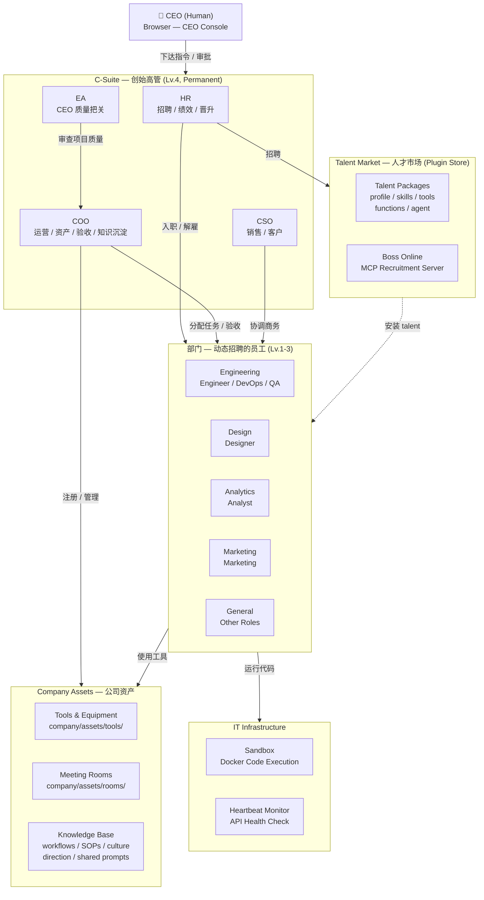
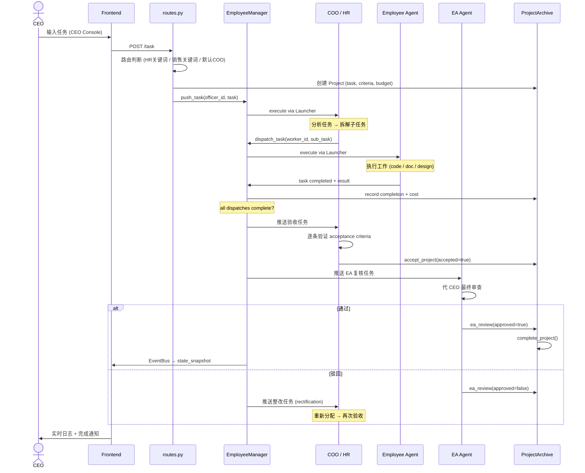
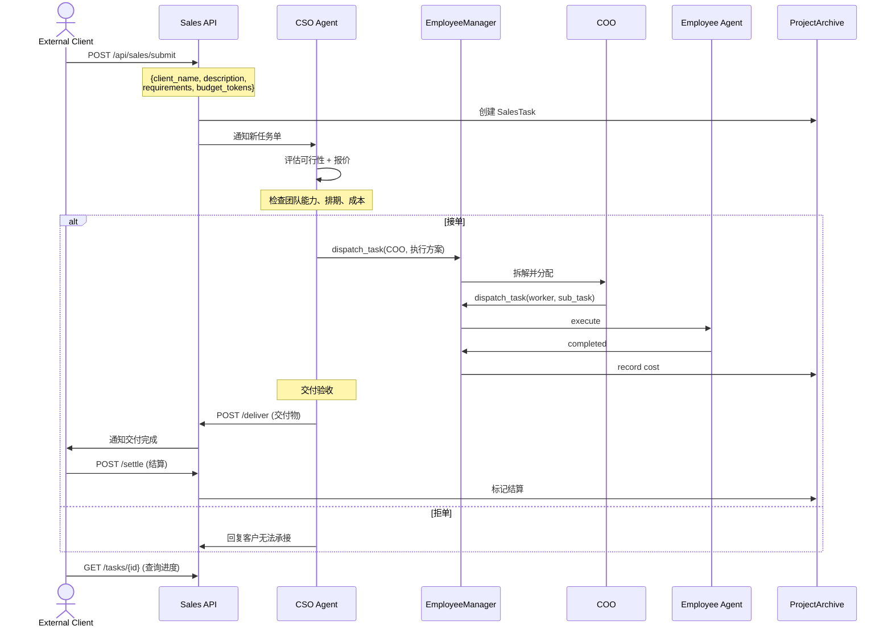

# OneManCompany

一人公司模拟器 — 像素风办公室 + LangChain AI Agent 自主运营

CEO（真人）通过浏览器下达指令，AI 高管团队（HR / COO / EA / CSO）自动拆解、分配、执行、验收。
员工来自 Talent Market（即插即用的 agent 插件），支持 company-hosted、self-hosted、remote 三种运行模式。

---

## 1. Company Overview — 公司全景

> 把系统当成一家真实运转的公司来看：CEO 是唯一的真人，其余全部由 AI Agent 驱动。



**运转模式**：CEO 在浏览器输入任务 → 系统路由到对应高管 → 高管拆解并 `dispatch_task()` 给合适员工 → 员工执行 → 高管验收 → EA 复核 → 项目归档。

---

## 2. Module Architecture — 技术模块

> 从代码视角看各层模块如何连接。纵向是调用链，横向是同层协作。

```mermaid
graph TB
    subgraph Presentation["表现层 — Frontend"]
        HTML["index.html<br>3-Column Layout"]
        OfficeJS["office.js<br>Canvas 2D Pixel Art"]
        AppJS["app.js<br>CEO Console + WS Client"]
    end

    subgraph Gateway["网关层 — FastAPI"]
        REST["routes.py<br>/task /hire /fire /state<br>/talents /projects"]
        WSS["websocket.py<br>/ws Real-time Push"]
    end

    subgraph AgentLayer["Agent 层 — LangChain Agents"]
        direction TB
        subgraph Runners["Agent Runners"]
            BAR["BaseAgentRunner<br>streaming / prompt / status"]
            EA2["EmployeeAgent<br>通用员工 runner"]
            Custom["Custom Runner<br>talent 自带 runner"]
        end
        subgraph Founding["创始 Agent (专用 prompt + tools)"]
            HRA["HRAgent"]
            COOA["COOAgent"]
            EAA["EAAgent"]
            CSOA["CSOAgent"]
        end
        subgraph AgentInfra["Agent 基础设施"]
            PB["PromptBuilder<br>composable sections"]
            CT["common_tools.py<br>dispatch / meeting<br>list_colleagues / file ops"]
            OB["onboarding.py<br>hire flow + talent install"]
            TM["termination.py<br>fire flow + cleanup"]
        end
    end

    subgraph CoreEngine["核心引擎 — Core"]
        EM["EmployeeManager<br>on-demand task dispatch<br>hooks / history / retry"]
        EB["EventBus<br>async pub/sub"]
        CS["CompanyState<br>singleton + hot-reload"]
        PA["ProjectArchive<br>lifecycle / cost / iteration"]
        RT["routine.py<br>post-task workflows"]
        WE["workflow_engine.py<br>markdown → steps"]
        LY["layout.py<br>office grid allocation"]
        CFG["config.py<br>paths / constants / loaders"]
    end

    subgraph LauncherLayer["Launcher 协议 — 执行后端"]
        LC["LangChainLauncher<br>company-hosted"]
        CL["ClaudeSessionLauncher<br>self-hosted (CLI)"]
        SL["ScriptLauncher<br>bash scripts"]
    end

    subgraph TalentLayer["Talent Market"]
        TS["talent_spec.py<br>TalentPackage<br>AgentManifest"]
        BO["boss_online.py<br>MCP Server"]
        TD["talents/{id}/<br>profile / skills / tools<br>functions / agent"]
    end

    subgraph Persistence["持久层 — company/"]
        EMP["employees/{id}/<br>profile / skills / agent"]
        AST["assets/<br>tools / rooms"]
        BIZ["business/<br>workflows / projects<br>resolutions / reports"]
        CUL["company_culture.yaml<br>company_direction.yaml<br>shared_prompts/"]
    end

    %% Presentation → Gateway
    AppJS -->|"HTTP + WS"| Gateway

    %% Gateway → Core
    REST --> EM
    REST --> CS
    WSS --> EB

    %% Core orchestration
    EM -->|"dispatch"| LauncherLayer
    EM --> EB
    EM --> PA
    EB --> WSS
    RT --> WE
    CS --> CFG
    LY --> CS

    %% Launchers → Runners
    LC --> BAR
    CL -->|"claude CLI"| EMP
    SL -->|"launch.sh"| EMP

    %% Agent hierarchy
    HRA --> BAR
    COOA --> BAR
    EAA --> BAR
    CSOA --> BAR
    EA2 --> BAR
    Custom --> BAR
    BAR --> PB
    BAR --> CT

    %% Onboarding path
    OB --> TS
    OB --> EM
    OB --> CFG

    %% Data access
    CFG --> Persistence
    COOA --> AST
    PA --> BIZ
```



**关键分层**：
- **表现层**：纯静态前端，零构建工具，Canvas 像素画 + WebSocket 实时推送
- **网关层**：FastAPI REST + WS，负责路由和认证
- **Agent 层**：所有 AI 角色的实现，共享 `BaseAgentRunner` 和 `PromptBuilder`
- **核心引擎**：`EmployeeManager` 统一调度，`EventBus` 事件驱动，`CompanyState` 单例状态
- **Launcher 层**：插拔式执行后端，同一调度协议支持三种运行模式
- **持久层**：YAML + Markdown + JSON，git-friendly，无数据库依赖

---

## 3. Operating Modes — 运转模式

公司有两种驱动模式，对应不同的任务入口，但共享同一套执行 → 验收 → 归档管线。

### Mode A: CEO 驱动 — 内部经营

> CEO 通过浏览器直接下达指令，高管拆解执行。这是日常经营模式。



### Mode B: 互联网任务单驱动 — 对外接单

> 外部客户通过 Sales API 提交任务单，CSO 接单评估，内部团队执行交付。公司作为服务商运转。



**两种模式对比**：

| | CEO 驱动 | 互联网任务单 |
|---|---|---|
| **入口** | CEO Console (Browser) | Sales API (`/api/sales/submit`) |
| **路由** | 关键词匹配 → HR / COO / CSO | CSO 统一接单 |
| **质量门** | 员工自检 → 高管验收 → EA 复核 | CSO 验收 → 交付客户 |
| **结算** | 内部 cost tracking | 客户 budget_tokens 结算 |
| **场景** | 日常经营、产品开发、内部建设 | 对外接活、SaaS 交付、定制开发 |

**共享的核心管线**：无论哪种模式，底层都走 `EmployeeManager.push_task()` → `Launcher.execute()` → `ProjectArchive` 同一条执行链路。

---

## Module Index

| Layer | Module | Role |
|-------|--------|------|
| **Entry** | `main.py` | FastAPI app, lifespan (register agents, sandbox, watchdog, heartbeat) |
| **API** | `routes.py` | REST: `/task`, `/hire`, `/fire`, `/state`, talent market, projects |
| **API** | `websocket.py` | WS `/ws` — broadcasts EventBus events to frontend |
| **Agents** | `base.py` | `BaseAgentRunner` (streaming, prompt building), `EmployeeAgent` |
| **Agents** | `hr_agent.py` | Hiring, performance review, promotion, quarterly cycle |
| **Agents** | `coo_agent.py` | Asset management, meeting rooms, project acceptance, knowledge deposit |
| **Agents** | `ea_agent.py` | CEO quality gate — final review before project close |
| **Agents** | `cso_agent.py` | Sales pipeline, client outreach |
| **Agents** | `common_tools.py` | `dispatch_task`, `pull_meeting`, `list_colleagues`, file/sandbox ops |
| **Agents** | `prompt_builder.py` | Named sections with priority, composable prompt system |
| **Agents** | `onboarding.py` | `execute_hire()`, talent asset install, agent config, hooks |
| **Agents** | `termination.py` | `execute_fire()`, tool cleanup, layout recompute |
| **Core** | `config.py` | All paths, constants, employee/talent config loaders |
| **Core** | `state.py` | `CompanyState` singleton, hot-reload, employee/project state |
| **Core** | `events.py` | Async `EventBus` — pub/sub for all system events |
| **Core** | `agent_loop.py` | `EmployeeManager`, `Launcher` protocol, task queue, hooks, history |
| **Core** | `routine.py` | Post-task workflow dispatch (project retrospective, etc.) |
| **Core** | `workflow_engine.py` | Parses `company/business/workflows/*.md` → `WorkflowDefinition` |
| **Core** | `project_archive.py` | Project CRUD, iteration tracking, cost recording |
| **Core** | `layout.py` | Department-based office grid, desk allocation |
| **Talent** | `talent_spec.py` | Dataclasses: `TalentPackage`, `AgentManifest`, `FunctionsManifest` |
| **Talent** | `boss_online.py` | MCP server subprocess for recruitment |
| **Infra** | `tools/sandbox/` | Docker-based code execution (execute, run\_command, write/read) |
| **Infra** | `claude_session.py` | Claude Code CLI session management (self-hosted employees) |
| **Infra** | `heartbeat.py` | Periodic API connectivity check (zero token cost) |
| **Frontend** | `index.html` | 3-column layout: Office / Console / Details |
| **Frontend** | `office.js` | Canvas 2D pixel art renderer, sprite system |
| **Frontend** | `app.js` | CEO console, WebSocket handler, UI state |

## Tech Stack

- **Backend**: Python 3.12+ / UV, FastAPI + WebSocket, LangChain (`create_react_agent`)
- **LLM**: OpenRouter API (configurable per employee), Anthropic API (OAuth/API key)
- **Frontend**: Vanilla JS + Canvas 2D pixel art (no build tools)
- **Infra**: Docker sandbox, MCP server, Watchdog hot-reload
- **Data**: YAML profiles + Markdown workflows + JSON project archives

## Quick Start

```bash
# 1. Install
uv sync

# 2. Configure
cp .env.example .env   # fill OPENROUTER_API_KEY

# 3. Run
uv run onemancompany

# 4. Open
open http://localhost:8000
```

## Key Concepts

| Concept | Description |
|---------|-------------|
| **Talent = Plugin** | `talents/{id}/` 是自包含的 agent 包（profile / skills / tools / functions / agent config） |
| **Agent Modularization** | 三层定制：prompt sections（轻量）→ lifecycle hooks（中等）→ custom runner（完全替换） |
| **EmployeeManager** | 中央调度器，on-demand 推送任务，无空转轮询 |
| **Launcher Protocol** | `LangChainLauncher` / `ClaudeSessionLauncher` / `ScriptLauncher` — 统一接口，三种后端 |
| **EventBus** | 所有状态变更 → async pub/sub → WebSocket → 前端实时更新 |
| **Knowledge Deposit** | COO 通过 `deposit_company_knowledge()` 将 workflow / SOP / culture / guidance 沉淀到公司知识库 |

---

## Changelog

<!-- CHANGELOG_START -->
| Date | Summary |
|------|---------|
| 2026-03-04 | • update: test_routes |
| 2026-03-04 | • fix test mock leak for company_direction |
| 2026-03-04 | • add 976 unit tests across all modules <br> • add pre-commit test runner + changelog hook |
| 2026-03-04 | • agent loop modularization (custom runners, hooks, prompt sections) <br> • COO deposit_company_knowledge tool <br> • company direction frontend polish button |
<!-- CHANGELOG_END -->
