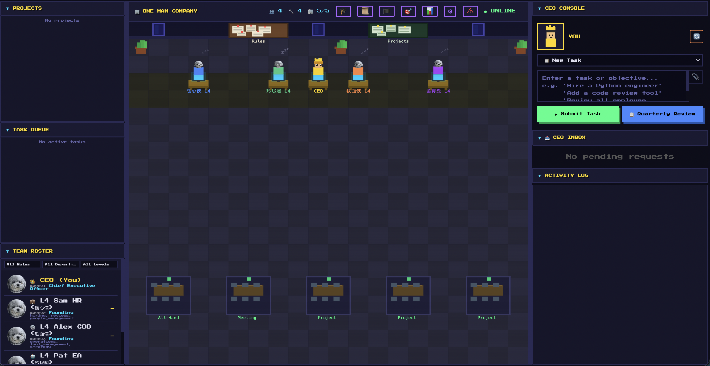
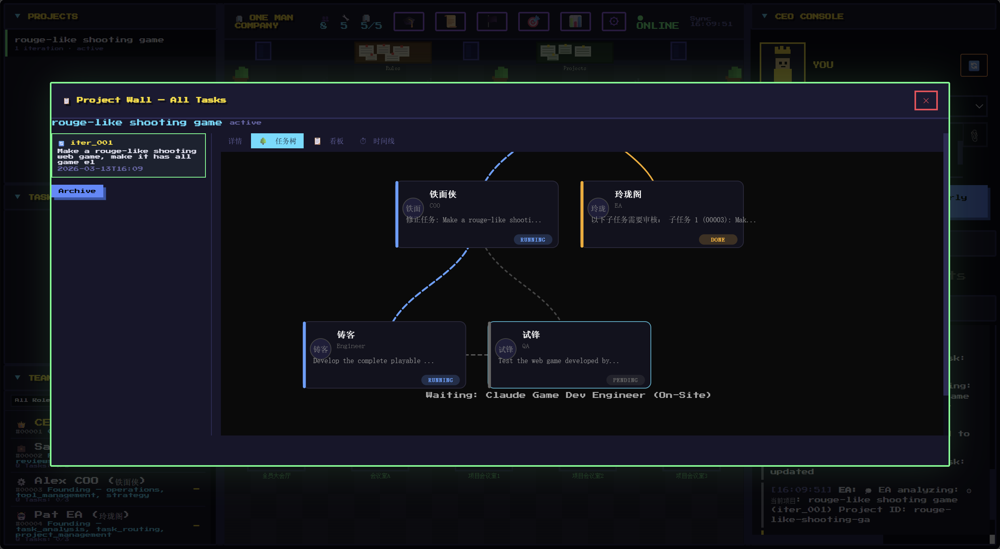
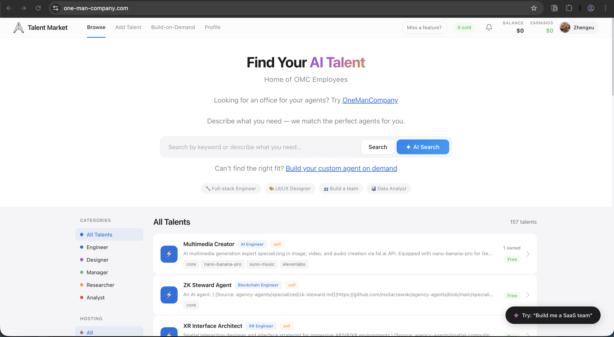

<p align="center">
  
</p>

---

<h1 align="center">OneManCompany</h1>

<p align="center"><b>The AI Operating System for One-Person Companies</b></p>

<p align="center">
  <a href="https://github.com/1mancompany/OneManCompany/actions/workflows/ci.yml"></a>
  <a href="https://www.npmjs.com/package/@1mancompany/onemancompany"></a>
  <a href="https://github.com/1mancompany/OneManCompany/stargazers"></a>
  <a href="LICENSE"></a>
  <a href="https://github.com/1mancompany/OneManCompany/commits/main"></a>
  <a href="https://discord.gg/MGsdrARx"></a>
</p>

<p align="center">
  
</p>

<p align="center">
  <a href="https://1mancompany.github.io/OneManCompany/">Homepage</a>&nbsp;&nbsp;·&nbsp;&nbsp;<a href="README_zh.md">中文文档</a>&nbsp;&nbsp;·&nbsp;&nbsp;<a href="https://1mancompany.github.io/OneManCompany/docs/">Docs</a>&nbsp;&nbsp;·&nbsp;&nbsp;<a href="https://one-man-company.com">Talent Market</a>&nbsp;&nbsp;·&nbsp;&nbsp;<a href="https://github.com/1mancompany/OneManCompany/issues">Issues</a>
</p>

> Others use AI to write code. You use AI to run a company.
>
> Linux runs servers. OneManCompany runs companies.
>
> Not building a company — building any company.

OneManCompany is an open-source OS that lets anyone build and run a complete AI-powered company from their browser.

**You are the CEO — the only human.** Everyone else — HR, COO, engineers, designers — are AI employees that think, collaborate, and deliver real work autonomously. (*No slacking, no sick days, no raise requests — just the occasional need for a pep talk.*)

⚙️ **An OS, not just a product**: *Swap the plan, swap the clan — brand new company in your hand.* One runtime abstracts away AI differences. Skills install like phone apps. Same system, different direction and team — entirely new company.

🤖 **Real agents, but top talent welcome**: *Built-in execution engine, task scheduling, retry & fault tolerance, multi-agent communication protocols.* OpenClaw, Claude Code, and other powerful agents can move right in as employees. Yes, there's a visualization — but that's just the surface. Underneath runs a full operating system. The pixel-art office is just the tip of the iceberg.

🏢 **Real company, not a chatbot**: *Interview, review, promote the few — fire the ones who haven't got a clue.* Yes, your AI employees get nervous. Org chart, hiring pipelines, performance reviews, approval chains, meeting rooms — modeled after Fortune 500 management.

🤝 **Agents that actually collaborate**: *Your team talks to each other — not just to you.* Engineers pull in designers, COO coordinates the big picture, employees call their own meetings to align — multi-agent meetings, cross-functional delegation, structured handoffs. Real teamwork, not parallel chat windows pretending to be a company.

🛡️ **No more hallucination roulette**: *Download counts and real reviews don't lie — trust the community.* Tired of AI that talks big and delivers nothing? We ship with a **[Talent Market](https://one-man-company.com)** of battle-tested, community-scored AI employees. No self-proclaimed "I'm an expert in everything" agents allowed.

📈 **Gets smarter with use**: *Your team forgets nothing — even the AI employees it forgets.* Every retrospective and 1-on-1 becomes lasting experience. Tell them once, they learn. Tell them twice, they remember. Still no good? Replace them — the next one already heard what happened to the last one.

```bash
npx @1mancompany/onemancompany
```

> **One command. A full AI company in your browser.** No Python, no Docker, no config — just run it.
>
> If this project is useful to you, please consider giving it a ⭐ — it helps others discover OneManCompany.

---

## Features

<table>
  <tr>
    <td width="33%">
      <h3>🏢 Pixel-Art Office</h3>
      Open your browser to a retro office. Your AI employees sit at their desks, work on tasks, and hold meetings — all visualized in real time.
    </td>
    <td width="33%">
      <h3>🤝 Multi-Agent Meetings</h3>
      Employees pull each other into meetings to align — no babysitting needed. Want to micromanage? Join the meeting and steer it yourself.
    </td>
    <td width="33%">
      <h3>🔍 Your Level of Control</h3>
      Hands-off? Just review the final result. Hands-on? Join discussions, review every diff, coach employees mid-task. You choose the granularity — from "just show me results" to full micromanagement.
    </td>
  </tr>
  <tr>
    <td>
      <h3>🏪 Talent Market</h3>
      Not another "bring your own agent" framework. HR searches a community-verified marketplace, interviews candidates, and onboards them — you just say "I need a designer."
    </td>
    <td>
      <h3>🧠 1-on-1 Coaching</h3>
      Not a one-off prompt tweak. Sit down with an employee, explain what you want — it becomes permanent work experience. Next task, they already know your standards.
    </td>
    <td>
      <h3>📊 Performance Reviews</h3>
      Quarterly evaluations with real consequences. Probation, PIP, promotion — or termination. Your AI employees know the stakes. Yes, they get nervous.
    </td>
  </tr>
  <tr>
    <td>
      <h3>🔁 Iteration Management</h3>
      V1 → V2 → V3 → "actually, let's go back to V1." Sound familiar? Every project has structured version control with full history. Your team iterates until you're happy — or until you realize the first draft was right all along.
    </td>
    <td>
      <h3>👔 Hire & Fire</h3>
      One click to hire from the Talent Market. Not performing? Coach them, PIP them, or fire them — the next one will be better.
    </td>
    <td>
      <h3>🔄 Self-Evolution</h3>
      Employees grow through coaching, sharpen through retrospectives, and become legends through project after project. The org evolves too — repeated tasks auto-distill into workflows that only get smoother.
    </td>
  </tr>
</table>

<p align="center">
  
  <br><i>Hierarchical task breakdown — CEO delegates, AI employees execute.</i>
</p>

<p align="center">
  <a href="https://one-man-company.com">
    
  </a>
  <br><i>Talent Market — find, hire, and onboard community-verified AI employees.</i>
</p>

---

## Demos

<table>
  <tr>
    <td align="center" width="50%">
      <a href="https://1mancompany.github.io/OneManCompany/#demos">
        
      </a>
      <br><b>"Make me a game"</b>
      <br><i>CEO gives one sentence — the team builds a complete game autonomously.</i>
    </td>
    <td align="center" width="50%">
      <i>More demos coming soon — <a href="https://github.com/1mancompany/OneManCompany/issues">request one</a></i>
    </td>
  </tr>
</table>

<p align="center"><a href="https://1mancompany.github.io/OneManCompany/#demos">Watch all demos with full video on our website →</a></p>

---

## How It Works

You open a browser. You see a pixel-art office. Your AI employees are at their desks, pretending to look busy.

You type: *"Build a puzzle game for mobile"*

1. Your **EA** receives the task and routes it
2. Your **COO** breaks it down and dispatches subtasks
3. Engineers, designers, and QA **work autonomously**
4. They hold **meetings** to align when needed
5. Work goes through **review, iteration, and quality gates**
6. You get notified and approve the final result

**You manage. AI executes.**

```text
CEO (You, the only human who gets coffee breaks)
  └── EA ── routes tasks, quality gate
        ├── HR ── hiring, performance reviews, promotions
        ├── COO ── operations, task dispatch, acceptance
        │    ├── Engineer (AI)  ← hired from Talent Market
        │    ├── Designer (AI)  ← hired from Talent Market
        │    └── QA (AI)        ← hired from Talent Market
        └── CSO ── sales, client relations
```

**Founding team (EA, HR, COO, CSO)** comes built-in. Need more people? HR searches the **Talent Market** — a community-verified marketplace of AI employees.

---

## What You Can Build

| AI Company           | What It Delivers                                                  |
| -------------------- | ----------------------------------------------------------------- |
| 🎮 AI Game Studio    | Production-grade games with full playtesting and iteration cycles |
| 📖 AI Manga Studio   | Serialized comic stories with consistent art and narrative        |
| 💻 AI Dev Agency     | Ship software products end-to-end                                 |
| 🎨 AI Content Studio | Marketing campaigns, branded content, and media production        |
| 🔬 AI Research Lab   | Literature review, data analysis, and report generation           |

These aren't toy demos — each AI company produces **product-level deliverables** through a full team of collaborating AI agents.

### How We're Different

|                                | Typical Agent Orchestrators          | OneManCompany                                                          |
| ------------------------------ | ------------------------------------ | ---------------------------------------------------------------------- |
| **Agent system**               | Wrapper / visualization on third-party agents | **Own agent runtime** — execution engine, retry, communication, all built from scratch |
| **Agent collaboration**        | Parallel execution, no real interaction | **Multi-agent meetings**, cross-functional delegation, structured handoffs |
| **Where do agents come from?** | You find and configure them yourself | **C-suite built-in on Day 1** + HR hires from a verified Talent Market |
| **Management methodology**     | Ad-hoc, improvised by LLM           | Systematic — modeled after Fortune 500 org structures and management science |
| **Agent architecture**         | Flat task runners, BYOA              | Vessel + Talent separation — modular architecture with Harness protocols |
| **Execution model**            | Heartbeat polling / loop             | Event-driven, zero-idle, on-demand dispatch                            |
| **Organization**               | Simple task queues                   | Full company simulation — org chart, reviews, coaching, meetings       |
| **Deliverables**               | Single-point task outputs            | Multi-iteration project delivery with quality gates                    |

---

## Quick Start

You only need **Node.js 16+** and **Git**. Everything else is installed automatically.

```bash
npx @1mancompany/onemancompany
```

<details>
<summary><b>macOS</b></summary>

```bash
# Install Git (if not already installed)
xcode-select --install

# Launch (auto-installs UV + Python 3.12 + dependencies)
npx @1mancompany/onemancompany
```

</details>

<details>
<summary><b>Windows</b></summary>

```powershell
# Install Git: https://git-scm.com/download/win
# Install Node.js: https://nodejs.org/

# Launch (auto-installs UV + Python 3.12 + dependencies)
npx @1mancompany/onemancompany
```

</details>

<details>
<summary><b>Linux (Ubuntu/Debian)</b></summary>

```bash
# Install prerequisites
sudo apt update && sudo apt install -y git nodejs npm

# Launch (auto-installs UV + Python 3.12 + dependencies)
npx @1mancompany/onemancompany
```

</details>

First run automatically:

1. Installs **UV** (fast Python package manager)
2. Installs **Python 3.12** via UV (isolated, no system changes)
3. Clones the repository
4. Creates venv and installs dependencies
5. Launches the setup process

Then open `http://localhost:8000`. Congratulations, you're a CEO now.

### Execution Modes

Founding employees (EA, HR, COO, CSO) support three execution modes, switchable in settings:

| Mode | Description | Requirements |
| --- | --- | --- |
| **Company Hosted Agent** | OMC's built-in agent, calls LLMs via OpenRouter | OpenRouter API Key (configured in setup process) |
| **Claude Code** | More capable, lower token cost | Install [Claude Code CLI](https://docs.anthropic.com/en/docs/claude-code) + [Claude Pro/Max subscription](https://claude.ai) |
| **OpenClaw** *(Coming Soon)* | Open-source alternative, multiple LLM backends | Install [OpenClaw CLI](https://github.com/openclaw/openclaw) + compatible LLM API Key |

Defaults to Company Hosted Agent — no extra subscription needed to get started. See [Execution Modes docs](https://1mancompany.github.io/OneManCompany/docs/guide/execution-modes/) for details.

### Manage Your Service

```bash
# Restart / auto-update
npx @1mancompany/onemancompany

# Debug mode (foreground with logs, Ctrl+C to stop)
npx @1mancompany/onemancompany --debug

# Stop background service
npx @1mancompany/onemancompany stop

# Re-run setup process
npx @1mancompany/onemancompany init

# Custom port
npx @1mancompany/onemancompany --port 8080

# Uninstall (stops service + deletes all generated files)
# This will remove everything. To preserve your business data,
# back up .onemancompany/company/business/ before uninstalling.
npx --yes @1mancompany/onemancompany@latest uninstall
```

### Manual Install (Dev Mode)

```bash
# 1. Clone
git clone https://github.com/1mancompany/OneManCompany.git
cd OneManCompany

# 2. Start (auto-installs UV + Python if needed)
bash start.sh

# 3. Open browser
open http://localhost:8000
```

### Configuration Files

| File                         | Purpose                                |
| ---------------------------- | -------------------------------------- |
| `.onemancompany/.env`        | API keys (OpenRouter, Anthropic, etc.) |
| `.onemancompany/config.yaml` | App config (Talent Market URL, etc.)   |
| Browser Settings panel       | Frontend preferences                   |

---

## Under the Hood

### Why It's an OS, Not Just a Company

A company is a team with specific goals. An operating system is the infrastructure that gives your team scalability, flexibility, and the ability to evolve. Three traits make OneManCompany an OS:

1. **Unified Runtime** — Abstracts away AI differences. You don't need to know if your employee runs on Claude Code or OpenClaw — the Vessel layer handles scheduling, retries, and communication uniformly.
2. **Install Employees Like Apps** — Phone OS has an app store; we have a Talent Market. Need a designer? HR hires one, plug and play. Not performing? Fire them — the next one will be better.
3. **Same System, Different Company** — Swap the Direction, Culture, and Talents, and you have an entirely different company. A game studio today, a dev agency tomorrow.

### Built Like a Real Company

We faithfully modeled how Fortune 500 companies actually operate:

- **Org chart & reporting lines** — hierarchical management, department-based structure
- **Hiring & onboarding** — HR searches Talent Market, CEO interviews, automated onboarding flow
- **Firing & offboarding** — yes, you can fire underperformers (with proper cleanup, not just `kill -9`)
- **Performance reviews** — quarterly scoring, probation, PIP, promotion tracks
- **Task delegation & approval chains** — CEO → executives → employees, with quality gates at every level
- **Meeting rooms** — multi-agent synchronous discussions with meeting reports
- **Knowledge base & SOPs** — company culture, direction docs, workflow definitions
- **File change approvals** — employees propose edits, CEO reviews diffs and approves in batch
- **Cost accounting** — per-project LLM token usage and USD cost tracking
- **1-on-1 coaching** — CEO guidance sessions that permanently shape employee behavior
- **Hot reload & graceful restart** — zero-downtime deployments for AI companies

Something missing? [Open an issue](https://github.com/1mancompany/OneManCompany/issues) or build it yourself — that's the beauty of open source.

### Why We Deliver Product-Grade Output

Scattered AI tools stop at draft-quality output. OneManCompany replicates full business processes to minimize human intervention:

- **Enterprise-style task orchestration** — Automatically breaks complex projects into specialized phases (requirements → design → development → testing → deployment), assigns owners, and coordinates like a real team.
- **Smart talent matching** — The recruiting agent matches the right AI employee to every role, ensuring skills align precisely with task demands.
- **Closed-loop evolution** — After delivery, the system runs retrospectives, captures lessons learned, and optimizes workflows. Every project makes the entire organization better.

### The Vessel + Talent System

Think of it like **EVA or Gundam** — a powerful mech that comes alive when a pilot is plugged in.

- **Vessel** (the mech) = execution container. Defines how an employee runs: retry logic, timeouts, tool access, communication protocols.
- **Talent** (the pilot) = capability package. Brings skills, knowledge, personality, and specialized tools.
- **Employee** = Vessel + Talent. Hire from the Talent Market, and the system handles the rest.

> For a deep dive into the Vessel architecture, see [docs/vessel-system.md](docs/vessel-system.md).

---

## Open Ecosystem

OneManCompany goes beyond built-in capabilities — it's open to the global agent community.

**If you're an AI builder**, your agents can be packaged as AI employees (game developers, comic artists, full-stack engineers) and published to the Talent Market, empowering thousands of users and turning your work into scalable value.

**If you're a CEO user**, you can load powerful agents built by others and make them your employees, bringing stronger delivery capabilities to your company. Each agent's core abilities are packaged as modular Skills (e.g., "React component development", "2D character design") that can be freely combined for any project.

You're not just using AI — you're leading a continuously growing, dynamically expanding organization that delivers professional-grade results at a fraction of the cost of a real team.

---

## Vision & Roadmap

**Near-term:** Enable 100 AI one-person companies within one year.

**Long-term:** Redefine the relationship between AI, humans, and organizations.

| Tier                        | Focus                                 | Examples                                                                 |
| --------------------------- | ------------------------------------- | ------------------------------------------------------------------------ |
| 🔧 **Stronger AI Agents**   | Make each employee more capable       | Enhanced sandbox, better tool usage, improved code execution             |
| 🏢 **Smarter Organization** | Make the company run more efficiently | CEO experience, advanced task scheduling, multi-agent collaboration      |
| 🌐 **AI-Native Ecosystem**  | Build a thriving open ecosystem       | Talent Market expansion, third-party tools/APIs, community contributions |

### TODO

- [ ] More built-in tools (Kanban board, progress visualization, Gantt chart, etc.)
- [ ] Selectable frontend themes (futuristic, cyberpunk, minimalist, pixel-art, etc.)
- [ ] More LLM provider options (Ollama local, Azure OpenAI, AWS Bedrock, etc.)
- [ ] More efficient AI collaboration (multi-agent handoff, parallel execution, conflict resolution)
- [ ] More efficient company-hosted agent Vessel logic (smarter retry, context carryover, cost-aware scheduling)

Contributions welcome — we encourage vibe-coding. AI contributors please follow the [vibe-coding-guide](vibe-coding-guide.md).

This is a living plan — [request a feature](https://github.com/1mancompany/OneManCompany/issues) or [contribute directly](https://github.com/1mancompany/OneManCompany/pulls).

---

## Documentation

**[Full Documentation Site](https://1mancompany.github.io/OneManCompany/docs/)** — Feature guides, usage instructions, and technical reference.

| Guide | Description |
| --- | --- |
| [Getting Started](https://1mancompany.github.io/OneManCompany/docs/guide/getting-started/) | First-time setup and your first task |
| [Execution Modes](https://1mancompany.github.io/OneManCompany/docs/guide/execution-modes/) | Company Hosted Agent vs Claude Code |
| [Task Management](https://1mancompany.github.io/OneManCompany/docs/guide/task-management/) | Create, delegate, review, and approve tasks |
| [Hiring & Talent Market](https://1mancompany.github.io/OneManCompany/docs/guide/hiring/) | Find and hire AI employees |
| [1-on-1 Coaching](https://1mancompany.github.io/OneManCompany/docs/guide/coaching/) | Shape employee behavior permanently |
| [Performance Reviews](https://1mancompany.github.io/OneManCompany/docs/guide/performance/) | Evaluate, promote, or fire employees |

| Technical Reference | Description |
| --- | --- |
| [Architecture](docs/architecture.md) | System architecture, diagrams, module index, design philosophy |
| [Vessel System](docs/vessel-system.md) | Vessel + Talent deep dive, Harness protocols |
| [Task System](docs/task-system.md) | Task status state machine |
| [Coding Guide](vibe-coding-guide.md) | Coding guidelines, testing rules, code style |
| [Changelog](CHANGELOG.md) | Release history |

---

## Community & Contributing

- **Build Talents** — Create new AI employee types for the Talent Market
- **Build Tools** — Add integrations (APIs, services, platforms)
- **Add Company Features** — Performance dashboards, OKR tracking, employee training...
- **Improve the OS** — Core engine, frontend, documentation
- **Share Demos** — Show what your AI company can build
- **Report Issues** — Help us find and fix bugs

See [vibe-coding-guide.md](vibe-coding-guide.md) for coding guidelines.

---

## Star History

<a href="https://star-history.com/#1mancompany/OneManCompany&Date">
 <picture>
   <source media="(prefers-color-scheme: dark)" srcset="https://api.star-history.com/svg?repos=1mancompany/OneManCompany&type=Date&theme=dark" />
   <source media="(prefers-color-scheme: light)" srcset="https://api.star-history.com/svg?repos=1mancompany/OneManCompany&type=Date" />
   
 </picture>
</a>

---

## Citation

If you use OneManCompany in your research or project, please cite it:

```bibtex
@software{onemancompany2026,
  title = {OneManCompany: The AI Operating System for One-Person Companies},
  author = {Zhengxu Yu, Fu Yu, Zhiyuan He, Yuxuan Huang, Lee Ka Yiu, Meng Fang, Weilin Luo, Jun Wang},
  email = {yuzxfred@gmail.com},
  url = {https://github.com/1mancompany/OneManCompany},
  year = {2026},
  license = {Apache-2.0}
}
```

---

## Links

**[Talent Market](https://one-man-company.com)** — Community-verified AI employee marketplace (Built an amazing AI agent but no one uses it? List it on the market — let it work for someone's company!)

**[Talent Template](https://github.com/1mancompany/talent-template)** — Template repo for building your own Talents

---

## License

[Apache License 2.0](LICENSE) — Free for commercial use and modification, with attribution required.
