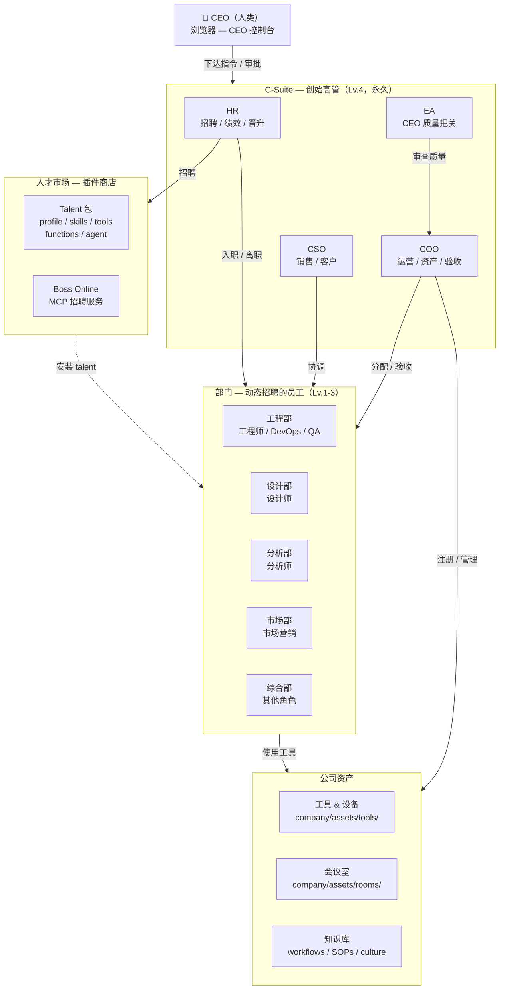
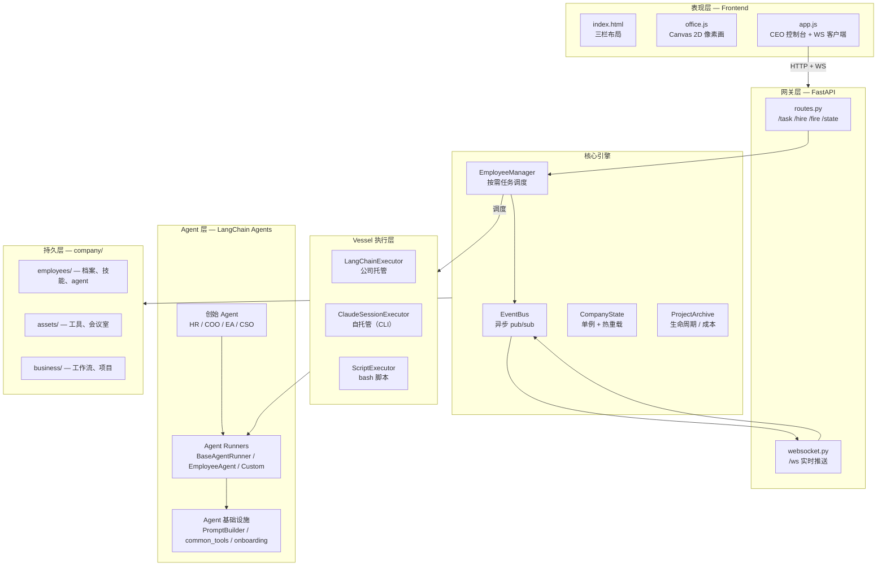
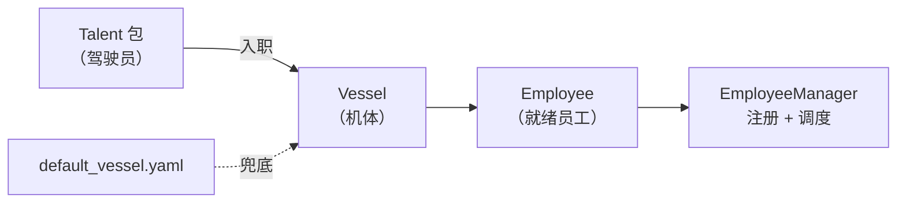
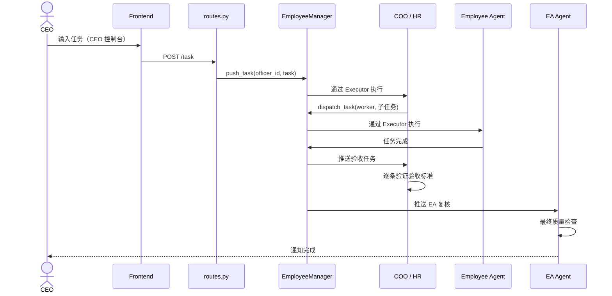

# OneManCompany

**AI 一人公司操作系统**

> 别人用 AI 写代码，你用 AI 开公司。
>
> 如果 Linux 是服务器的操作系统，OneManCompany 就是公司的操作系统。

OneManCompany 是一个开源的 AI 操作系统，让任何人都能在浏览器里组建并运营一整家 AI 驱动的公司。你是 CEO——唯一的人类。其余所有人——HR、COO、工程师、设计师——都是能独立思考、协作和交付的 AI 员工。

没错，你的 AI 员工有绩效考核。没错，他们会紧张。

[English](README.md)

---

## 为什么是 OneManCompany？

今天的 AI 工具帮你完成单点任务——写邮件、生成图片、修 Bug。挺可爱的。OneManCompany 给你**一整个组织。**

- **不是聊天机器人** —— 是一家有组织架构、招聘、任务管理、绩效考核、知识管理的完整公司
- **不是玩具 Demo** —— 交付产品级成果（游戏、漫画、应用——不是"这是初稿，您自己看着改吧"）
- **不是开发框架** —— 是一个开箱即用的平台，浏览器打开就能用，不需要写代码

### 你可以用它构建什么

| AI 公司 | 交付物 |
|---------|--------|
| 🎮 AI 游戏工作室 | 产品级游戏，包含完整的试玩和迭代流程 |
| 📖 AI 漫剧工作室 | 连载漫画故事，画风和叙事保持一致 |
| 💻 AI 开发公司 | 端到端交付软件产品 |
| 🎨 AI 内容工作室 | 营销活动、品牌内容、多媒体制作 |
| 🔬 AI 研究实验室 | 文献调研、数据分析、研究报告 |

这些不是单点 Demo——每家 AI 公司都通过一个完整的 AI 团队协作，产出**产品级交付物**。

### 我们有什么不同

大多数多 Agent 工具把 Agent 当成可替换的任务执行器——你"自带 Agent"，接上编排层，然后祈祷它能跑起来。OneManCompany 采用根本不同的方式：

| | 典型 Agent 编排工具 | OneManCompany |
|---|---|---|
| **Agent 架构** | 扁平的任务执行器，自带 Agent | Vessel + Talent 分离——深度模块化架构，6 类 Harness 协议，3 层定制能力 |
| **Agent 从哪来？** | 你自己找、自己配 | **创始高管（HR、COO、EA、CSO）开箱自带**。其他员工由 HR 从社区验证的**人才市场**招聘——不再为找不到好用的 Agent 发愁 |
| **执行模型** | 心跳轮询 / 循环 | 事件驱动，零空转，按需调度 |
| **组织管理** | 简单的任务队列 | 完全参照世界五百强企业架构（详见下方） |
| **交付成果** | 单点任务输出 | 产品级多轮迭代项目交付，带质量关卡 |

Vessel + Talent 架构不只是一个比喻——它是真正的工程分离，带来编排层无法实现的可组合性。更换执行后端不用动 Agent 逻辑；把新 Talent 插入现有 Vessel，几秒内就能得到一个全功能员工；社区开发的 Talent 可以在任何公司里通用。

### 完全参照真实企业架构

我们不是借用了几个企业术语——我们忠实地建模了世界五百强企业的运作方式。真实公司有的，我们都有（或者在路线图上，欢迎你来贡献）：

- **组织架构与汇报关系** —— 层级管理，部门制
- **招聘与入职** —— HR 搜索人才市场，CEO 面试，自动化入职流程
- **解雇与离职** —— 没错，你可以开除表现差的员工（有完整的清理流程，不是直接 `kill -9`）
- **绩效考核** —— 季度 3.25/3.5/3.75 评分，试用期，PIP，晋升通道
- **项目复盘** —— EA 主导的项目交付后复盘
- **任务委派与审批链** —— CEO → 高管 → 员工，每层都有质量关卡
- **会议室** —— 多 Agent 同步讨论，生成会议纪要
- **知识库与 SOP** —— 公司文化、方向文档、工作流定义、共享提示词
- **文件变更审批** —— 员工提议修改，CEO 审查 diff 后批量审批
- **成本核算** —— 按项目追踪 LLM token 用量和 USD 成本
- **1-on-1 辅导** —— CEO 找你谈话，怕不怕？不怕，因为这里的 PUA 是真的有用——谈完之后员工行为永久改变，写进 work principles
- **公司文化与方向** —— 注入到每个员工的 system prompt
- **热重载与优雅重启** —— 因为 AI 公司也需要零停机部署

缺了什么？[提个 Issue](https://github.com/CarbonKite/OneManCompany/issues) 或者自己来建——这就是开源的魅力。

### 为什么是"操作系统"，而不只是"一家公司"

你可能会问：为什么叫"操作系统"而不是"AI 公司"？

因为 OneManCompany 不是造**一家**公司——它让你造**任何一家**公司。三个特性让这成为可能：

**1. 企业定位（Company Direction）** —— 你写下愿景："我们是一家专注休闲解谜游戏的手游工作室"。或者"我们是一家专攻科幻题材的漫剧制作公司"。这段描述不是装饰文字——它被注入到每个员工的推理过程中，影响他们如何理解任务、做出决策、排列优先级。改变定位，整家公司随之转向。就像改 `/etc/hostname` 会改变机器认为自己是谁一样。

**2. 企业文化（Company Culture）** —— 你定义原则："快速交付，持续迭代"。或者"质量优先，永远"。这些不是贴在墙上的鸡汤——它们是控制每个员工行为的 system prompt。一个在"快速行动"文化里的 Agent 和一个在"三思而行"文化里的 Agent 会做出完全不同的权衡。同样的 Talent，同样的 Vessel，完全不同的公司性格。

**3. Vessel + Talent** —— 让一切可插拔的模块化架构。今天需要游戏工作室，明天需要开发公司？同一个 OS，同一套创始团队，从市场上换一批 Talent 就行。Vessel Harness 协议保证一切干净对接——执行后端、Agent 能力、工具集成——全部可替换，无需重写系统。

操作系统提供内核、进程调度器和设备驱动。你决定在上面跑什么程序。OneManCompany 提供组织架构、任务引擎和 Agent 基础设施。**你决定在上面建什么公司。**

Windows 不管你跑的是 Photoshop 还是 Excel。OneManCompany 不管你建的是游戏工作室还是 SaaS 公司。

---

## 运作原理

打开浏览器，你看到一间像素风办公室。你的 AI 员工正坐在工位上，假装很忙的样子。

你输入：*"做一个手机端的解谜游戏"*

接下来会发生什么：

1. 你的 **EA**（行政助理）接收任务并路由——终于有个不会弄丢你邮件的助理了
2. 你的 **COO** 拆解任务，分派给合适的员工
3. 工程师、设计师、QA **自主工作**
4. 需要对齐时，他们会开**会议**（没错，这个会也可以是一封邮件）
5. 工作经过**评审、迭代和质量关卡**
6. 你收到通知，审批最终成果

**你来管理，AI 来执行。** 没有站会，没有深夜 Slack 消息，只有结果。

```
CEO（你，唯一能喝咖啡的人）
  └── EA ── 任务路由、质量把关
        ├── HR ── 招聘、绩效考核、晋升
        ├── COO ── 运营、任务分派、验收
        │    ├── 工程师 (AI)  ← 从人才市场招聘
        │    ├── 设计师 (AI)  ← 从人才市场招聘
        │    └── QA (AI)      ← 从人才市场招聘
        └── CSO ── 销售、客户关系
```

**创始团队（EA、HR、COO、CSO）** 开箱即用——你的第一杯咖啡还没喝完，高管团队已经就位了。需要更多人手？你的 HR 会搜索**人才市场**——一个社区验证的 AI 员工市场。不用再到处找好用的 Agent，不用再折腾 prompt 工程——只需告诉 HR 你需要什么角色，审查候选人，然后招聘。HR 会搞定剩下的，包括入职手续（好吧，其实是 YAML 文件，但意思到了）。

### Vessel + Talent 系统

想象一下 **EVA 或高达** —— 一台强大的机体，注入不同的驾驶员就能发挥不同的能力。

- **Vessel（躯壳 / 机体）** = 执行容器。定义员工如何运行：重试策略、超时、工具权限、通信协议。
- **Talent（灵魂 / 驾驶员）** = 能力包。带来技能、知识、性格和专属工具。
- **Employee（员工）** = Vessel + Talent。从人才市场招聘，系统自动完成注入。

同一个 Vessel，注入不同 Talent → 不同的员工。
同一个 Talent，装进不同 Vessel → 不同的执行环境。

**对用户来说：** 招人就像逛应用商店，点击"招聘"即可。
**对开发者来说：** Vessel Harness 协议定义了 6 类标准化连接点，每个组件都可替换。

---

## 愿景 & 路线图

### 愿景

**近期目标：** 一年内赋能 100 家 AI 一人公司。

**长期愿景：** 重构 AI、人和组织的关系。AI 不再仅仅是工具——它是同事、队友、组织。

### 路线图

| 层级 | 方向 | 举例 |
|------|------|------|
| 🔧 **更强的 AI Agent** | 让每个员工更强 | 增强沙箱、更好的工具使用、更强的代码执行 |
| 🏢 **更高效的组织** | 让公司运转更流畅 | CEO 体验优化、高级任务调度、多 Agent 协作 |
| 🌐 **AI 原生生态** | 构建繁荣的开放生态 | 人才市场扩展、第三方工具/API、社区贡献 |

### 开发计划

| 状态 | 项目 | 说明 |
|------|------|------|
| 🚧 开发中 | **CSO（首席战略官）** | 战略规划 Agent——市场调研、竞品分析、战略建议 |
| 📋 计划中 | **更多可视化主题** | 不只是像素风——未来科技风主题即将上线。想要什么风格？[告诉我们](https://github.com/CarbonKite/OneManCompany/issues) |
| 📋 计划中 | **更多 Demo** | 产品级展示：AI 游戏工作室、AI 漫剧制作公司，以及更多 |

这是一份动态计划——我们会根据社区反馈不定期更新。[提需求](https://github.com/CarbonKite/OneManCompany/issues) 或 [直接贡献代码](https://github.com/CarbonKite/OneManCompany/pulls)，都欢迎。

---

## 快速开始

### 一键启动（推荐）

```bash
npx onemancompany
```

首次运行会自动进入配置向导（API Key、人才市场等）。完成后打开 `http://localhost:8000`。

### 手动安装

```bash
# 1. 克隆
git clone https://github.com/CarbonKite/OneManCompany.git
cd OneManCompany

# 2. 启动（首次运行进入配置向导，完成后自动启动）
bash start.sh

# 3. 打开浏览器
open http://localhost:8000
```

### 重启 / 重新配置

```bash
# 重启服务器
bash start.sh

# 指定端口
bash start.sh --port 8080

# 重新运行配置向导（修改 API Key 等）
bash start.sh init
```

### 配置文件

| 文件 | 用途 |
|------|------|
| `.onemancompany/.env` | API Keys（OpenRouter、Anthropic 等） |
| `.onemancompany/config.yaml` | 应用配置（人才市场 URL 等） |
| 浏览器 Settings 面板 | 前端偏好设置 |

---

## 核心概念

| 概念 | 说明 |
|------|------|
| **Vessel（躯壳）** | 机体——员工的执行容器，可配置 DNA |
| **Talent（灵魂）** | 驾驶员——自包含的能力包（技能、工具、性格） |
| **人才市场** | 插件商店——一键浏览和招聘 AI 员工 |
| **CEO 控制台** | 你的指挥中心——下达任务、管理团队、配置公司 |
| **CEO 收件箱** | 异步沟通通道——员工向你汇报，你随时回复 |
| **任务树** | 层级任务分解——父任务产出子任务，依赖关系自动追踪 |
| **会议室** | 多 Agent 同步讨论——员工在执行前对齐方案 |
| **知识库** | 公司记忆——工作流、SOP、文化文档、共享提示词 |
| **文件审批** | 安全编辑——员工提议文件修改，CEO 审核后生效 |

---

## 社区 & 贡献

OneManCompany 是一个开源项目。我们相信未来的工作方式是 AI 原生的，我们正在一起构建它。

### 如何参与

- **开发 Talent** —— 为人才市场创建新的 AI 员工类型
- **开发工具** —— 添加集成（API、服务、平台）
- **改进 OS** —— 核心引擎、前端、文档
- **分享 Demo** —— 展示你的 AI 公司能做什么
- **报告问题** —— 帮我们发现和修复 Bug

详细编码规范见 [vibe-coding-guide.md](vibe-coding-guide.md)。

---

# 技术参考

> 以下内容面向开发者和贡献者。

## 架构概览



### 系统分层



## 技术栈

- **后端**：Python 3.12+ / UV，FastAPI + WebSocket，LangChain（`create_react_agent`）
- **LLM**：OpenRouter API（每个员工可独立配置），Anthropic API（OAuth / API Key）
- **前端**：原生 JS + Canvas 2D 像素画（零构建工具）
- **基础设施**：Docker 沙箱，MCP 服务器，Watchdog 热重载
- **数据**：YAML 档案 + Markdown 工作流 + JSON 项目归档（git-friendly，无数据库依赖）

## Vessel 架构 — 深入解析

### 员工目录结构

```
employees/00010/
├── profile.yaml          # 员工档案
├── vessel/               # 躯壳 DNA
│   ├── vessel.yaml       # 配置：runner / hooks / limits / capabilities
│   └── prompt_sections/  # 提示词片段
├── skills/               # 灵魂 — 技能
└── progress.log          # 工作记忆
```

### vessel.yaml — DNA 配置

| 字段 | 说明 |
|------|------|
| `runner` | 神经系统 — 自定义 runner 模块和类名 |
| `hooks` | 生命周期钩子 — pre_task / post_task 回调 |
| `context` | 上下文注入 — prompt sections、进度日志、任务历史 |
| `limits` | 执行限制 — 重试次数、超时、子任务深度 |
| `capabilities` | 能力声明 — sandbox、文件上传、WebSocket、图片生成 |

### Vessel Harness — 六类连接协议

| Harness | 职责 |
|---------|------|
| `ExecutionHarness` | 执行套接件 — Executor 协议（execute / is_ready） |
| `TaskHarness` | 任务套接件 — 任务队列管理（push / get_next / cancel） |
| `EventHarness` | 事件套接件 — 日志和事件发布 |
| `StorageHarness` | 存储套接件 — 进度日志和历史持久化 |
| `ContextHarness` | 上下文套接件 — prompt / context 组装 |
| `LifecycleHarness` | 生命周期套接件 — pre/post task 钩子调用 |

### Talent → Employee 流程




## 运转模式

### 模式 A：CEO 驱动 — 内部经营



### 模式 B：互联网任务单 — 对外接单（规划中）

外部客户通过 Sales API 提交任务 → CSO 评估 → 内部团队交付。公司作为服务商运转。

## 任务状态系统

所有任务共享统一的 `TaskPhase` 状态机：

```
pending → processing ⇄ holding → completed → accepted → finished
              ↓                       ↓
           failed ──(retry)──→ processing

pending/holding → blocked（依赖失败）
any non-terminal → cancelled
```

| 状态 | 含义 |
|------|------|
| `pending` | 已创建，等待启动 |
| `processing` | Agent 正在执行 |
| `holding` | 等待子任务 / CEO 回复 |
| `completed` | 执行完毕，等待上级审核 |
| `accepted` | 上级通过（解除下游阻塞） |
| `finished` | 复盘后归档 |
| `failed` | 执行失败（可重试） |
| `blocked` | 依赖失败 |
| `cancelled` | 被 CEO 或上级取消 |

**Simple vs Project 任务**使用同一套状态机，区别在于自动跳过：
- **Simple**：`completed` → 自动 `accepted` → 自动 `finished`
- **Project**：`completed` → 手动审核 → EA 复盘 → `finished`

所有状态变更必须经过 `task_lifecycle.py` 的 `transition()` 方法。

## 模块索引

| 层级 | 模块 | 职责 |
|------|------|------|
| **入口** | `main.py` | FastAPI 应用，生命周期 |
| **API** | `routes.py` | REST 端点 |
| **API** | `websocket.py` | WS 实时推送 |
| **Agents** | `base.py` | `BaseAgentRunner`、`EmployeeAgent` |
| **Agents** | `hr_agent.py` | 招聘、绩效、晋升 |
| **Agents** | `coo_agent.py` | 运营、资产、验收 |
| **Agents** | `ea_agent.py` | CEO 质量把关 |
| **Agents** | `cso_agent.py` | 销售管线 |
| **Agents** | `common_tools.py` | 共享工具（dispatch、meeting、文件操作） |
| **Agents** | `prompt_builder.py` | 可组合提示词系统 |
| **Agents** | `onboarding.py` | 入职流程 + talent 安装 |
| **Agents** | `termination.py` | 离职流程 + 清理 |
| **Core** | `config.py` | 路径、常量、配置加载器 |
| **Core** | `state.py` | `CompanyState` 单例、热重载 |
| **Core** | `events.py` | 异步 `EventBus` pub/sub |
| **Core** | `vessel.py` | `Vessel`、`EmployeeManager`、`Executor` 协议 |
| **Core** | `vessel_config.py` | `VesselConfig`（DNA）加载/保存/迁移 |
| **Core** | `vessel_harness.py` | 6 类 Harness 协议 |
| **Core** | `routine.py` | 任务后工作流调度 |
| **Core** | `workflow_engine.py` | Markdown → `WorkflowDefinition` |
| **Core** | `project_archive.py` | 项目 CRUD、成本追踪 |
| **Core** | `layout.py` | 办公室网格分配 |
| **Talent** | `talent_spec.py` | `TalentPackage`、`AgentManifest` |
| **Talent** | `boss_online.py` | MCP 招聘服务 |
| **Infra** | `tools/sandbox/` | Docker 代码执行 |
| **Infra** | `claude_session.py` | Claude CLI 会话管理 |
| **Frontend** | `index.html` | 三栏布局 |
| **Frontend** | `office.js` | Canvas 2D 像素画渲染 |
| **Frontend** | `app.js` | CEO 控制台、WebSocket 处理 |

## 设计哲学

1. **系统性设计，不打补丁** —— 每个变更都是结构性的，不写 `if id == "特殊情况"`
2. **Registry/Dispatch 优于 if-elif** —— 数据驱动的模式
3. **完整数据包** —— 每个状态都可序列化、可恢复、有注册、有终结
4. **禁止静默异常** —— 必须 log，必须 re-raise `CancelledError`
5. **磁盘即唯一真相源** —— 业务数据不做内存缓存
6. **零空转** —— 没有 `while True` 轮询，事件驱动，按需执行
7. **Git-Friendly 持久化** —— YAML + Markdown + JSON，可 `git diff`、`git blame`、`git revert`
8. **最小复杂度** —— 三行重复代码好过一个过早的抽象

## 开发

详细编码规范、测试规则和代码风格见 [vibe-coding-guide.md](vibe-coding-guide.md)。

```bash
# 启动服务器
.venv/bin/python -m onemancompany.main

# 验证编译
.venv/bin/python -c "from onemancompany.api.routes import router; print('OK')"

# 运行测试
.venv/bin/python -m pytest tests/unit/ -x

# 检查前端语法
node -c frontend/app.js
```

---

## 更新日志

见 [CHANGELOG.md](CHANGELOG.md)。

---

## 许可证

[MIT](LICENSE)
