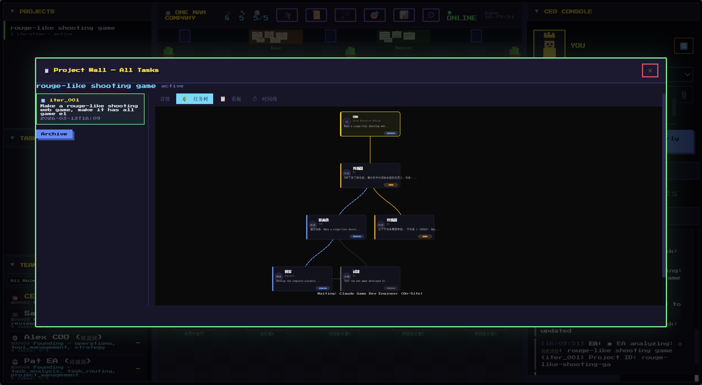

<p align="center">
  
</p>

<h1 align="center">OneManCompany</h1>

<p align="center"><b>AI 一人公司操作系统</b></p>

<p align="center">
  <a href="README.md">English</a>&nbsp;&nbsp;·&nbsp;&nbsp;<a href="https://carbonkites.com">Talent Market</a>&nbsp;&nbsp;·&nbsp;&nbsp;<a href="https://github.com/CarbonKite/OneManCompany/issues">Issues</a>
</p>

> 别人用 AI 写代码，你用 AI 开公司。
>
> 如果 Linux 是服务器的操作系统，OneManCompany 就是公司的操作系统。

OneManCompany 是一个开源的 AI 操作系统，让任何人都能在浏览器里组建并运营一整家 AI 驱动的公司。你是 CEO——唯一的人类。其余所有人——HR、COO、工程师、设计师——都是能独立思考、协作和交付的 AI 员工。

没错，你的 AI 员工有绩效考核。没错，他们会紧张。

受够了自动生成的 AI Agent 一本正经地胡说八道？OneManCompany 配套 **Talent Market**——社区验证过的真正能干活的 AI 员工，不是随机拼凑的幻觉机器。

---

## 为什么是 OneManCompany？

今天的 AI 工具帮你完成单点任务——写邮件、生成图片、修 Bug。挺可爱的。OneManCompany 给你**一整个组织。**

- **不是聊天机器人** —— 是一家有组织架构、招聘、任务管理、绩效考核、知识管理的完整公司
- **不是玩具 Demo** —— 交付产品级成果（游戏、漫画、应用——不是"这是初稿，您自己看着改吧"）
- **不是开发框架** —— 是一个开箱即用的平台，浏览器打开就能用，不需要写代码

### 你可以用它构建什么

| AI 公司          | 交付物                                 |
| ---------------- | -------------------------------------- |
| 🎮 AI 游戏工作室 | 产品级游戏，包含完整的试玩和迭代流程   |
| 📖 AI 漫剧工作室 | 连载漫画故事，画风和叙事保持一致       |
| 💻 AI 开发公司   | 端到端交付软件产品                     |
| 🎨 AI 内容工作室 | 营销活动、品牌内容、多媒体制作         |
| 🔬 AI 研究实验室 | 文献调研、数据分析、研究报告           |

这些不是单点 Demo——每家 AI 公司都通过一个完整的 AI 团队协作，产出**产品级交付物**。

### 我们有什么不同

|                    | 典型 Agent 编排工具        | OneManCompany                                                                    |
| ------------------ | -------------------------- | -------------------------------------------------------------------------------- |
| **Agent 架构**     | 扁平的任务执行器，自带 Agent | Vessel + Talent 分离——深度模块化架构，6 类 Harness 协议，3 层定制能力             |
| **Agent 从哪来？** | 你自己找、自己配           | **创始高管开箱自带**。其他员工由 HR 从社区验证的**人才市场**招聘                  |
| **执行模型**       | 心跳轮询 / 循环            | 事件驱动，零空转，按需调度                                                       |
| **组织管理**       | 简单的任务队列             | 完全参照世界五百强企业架构                                                       |
| **交付成果**       | 单点任务输出               | 产品级多轮迭代项目交付，带质量关卡                                               |

### 完全参照真实企业架构

- **组织架构与汇报关系** —— 层级管理，部门制
- **招聘与入职** —— HR 搜索人才市场，CEO 面试，自动化入职流程
- **解雇与离职** —— 完整的清理流程，不是直接 `kill -9`
- **绩效考核** —— 季度评分，试用期，PIP，晋升通道
- **任务委派与审批链** —— CEO → 高管 → 员工，每层都有质量关卡
- **会议室** —— 多 Agent 同步讨论，生成会议纪要
- **知识库与 SOP** —— 公司文化、方向文档、工作流定义
- **文件变更审批** —— 员工提议修改，CEO 审查 diff 后批量审批
- **成本核算** —— 按项目追踪 LLM token 用量和 USD 成本
- **1-on-1 辅导** —— CEO 谈话后员工行为永久改变，写进 work principles
- **热重载与优雅重启** —— AI 公司也需要零停机部署

缺了什么？[提个 Issue](https://github.com/CarbonKite/OneManCompany/issues) 或者自己来建——这就是开源的魅力。

### 为什么是"操作系统"

OneManCompany 不是造**一家**公司——它让你造**任何一家**公司：

1. **企业定位** —— 愿景注入每个员工的推理过程。改变定位，整家公司随之转向。
2. **企业文化** —— 行为原则控制每个员工。同样的 Talent，完全不同的公司性格。
3. **Vessel + Talent** —— 模块化架构让一切可插拔。同一个 OS，换一批 Talent 就是另一家公司。

---

## 功能展示

<!-- 宫格：每行 2 列，按图片数量自动扩展。添加更多 <td> 即可。 -->
<table>
  <tr>
    <td align="center" width="50%">
      
      <br><b>任务树</b> — 层级任务分解，依赖关系自动追踪
    </td>
    <td align="center" width="50%">
      
      <br><b>任务管理</b> — CEO 逐层审批，质量关卡把控
    </td>
  </tr>
  <!-- 添加更多截图，复制一个 <tr>...</tr> 块即可：
  <tr>
    <td align="center" width="50%">
      
      <br><b>标题</b> — 简要说明
    </td>
    <td align="center" width="50%">
      
      <br><b>标题</b> — 简要说明
    </td>
  </tr>
  -->
</table>

---

## 运作原理

打开浏览器，你看到一间像素风办公室。你的 AI 员工正坐在工位上，假装很忙的样子。

你输入：*"做一个手机端的解谜游戏"*

1. 你的 **EA** 接收任务并路由
2. 你的 **COO** 拆解任务，分派给合适的员工
3. 工程师、设计师、QA **自主工作**
4. 需要对齐时，他们会开**会议**
5. 工作经过**评审、迭代和质量关卡**
6. 你收到通知，审批最终成果

**你来管理，AI 来执行。**

```text
CEO（你，唯一能喝咖啡的人）
  └── EA ── 任务路由、质量把关
        ├── HR ── 招聘、绩效考核、晋升
        ├── COO ── 运营、任务分派、验收
        │    ├── 工程师 (AI)  ← 从人才市场招聘
        │    ├── 设计师 (AI)  ← 从人才市场招聘
        │    └── QA (AI)      ← 从人才市场招聘
        └── CSO ── 销售、客户关系
```

**创始团队（EA、HR、COO、CSO）** 开箱即用。需要更多人手？HR 搜索**人才市场**即可。

### Vessel + Talent 系统

想象一下 **EVA 或高达** —— 一台强大的机体，注入不同的驾驶员就能发挥不同的能力。

- **Vessel（躯壳）** = 执行容器。定义员工如何运行：重试策略、超时、工具权限、通信协议。
- **Talent（灵魂）** = 能力包。带来技能、知识、性格和专属工具。
- **Employee（员工）** = Vessel + Talent。从人才市场招聘，系统自动完成注入。

> Vessel 架构详解见 [docs/vessel-system_zh.md](docs/vessel-system_zh.md)。

---

## 快速开始

### 前置要求

只需要 **Node.js 16+** 和 **Git**。其他一切（UV、Python 3.12、依赖）都会自动安装。

<details>
<summary><b>macOS</b></summary>

```bash
# 安装 Git（如果还没有）
xcode-select --install

# 启动（自动安装 UV + Python 3.12 + 依赖）
npx @carbonkite/onemancompany
```

</details>

<details>
<summary><b>Windows</b></summary>

```powershell
# 安装 Git: https://git-scm.com/download/win
# 安装 Node.js: https://nodejs.org/

# 启动（自动安装 UV + Python 3.12 + 依赖）
npx @carbonkite/onemancompany
```

</details>

<details>
<summary><b>Linux (Ubuntu/Debian)</b></summary>

```bash
# 安装前置依赖
sudo apt update && sudo apt install -y git nodejs npm

# 启动（自动安装 UV + Python 3.12 + 依赖）
npx @carbonkite/onemancompany
```

</details>

首次运行自动完成：

1. 安装 **UV**（高速 Python 包管理器）
2. 通过 UV 安装 **Python 3.12**（隔离环境，不影响系统）
3. 克隆仓库
4. 创建虚拟环境并安装依赖
5. 启动配置向导（API Key、人才市场等）

完成后打开 `http://localhost:8000`，恭喜你成为 CEO。

### 再次启动

```bash
# 方式 1：再跑 npx（有新版本会自动更新）
npx @carbonkite/onemancompany

# 方式 2：直接进目录启动
cd OneManCompany
bash start.sh
```

### 手动安装

```bash
# 1. 克隆
git clone https://github.com/CarbonKite/OneManCompany.git
cd OneManCompany

# 2. 启动（自动安装 UV + Python，首次运行进入配置向导）
bash start.sh

# 3. 打开浏览器
open http://localhost:8000    # macOS
# xdg-open http://localhost:8000  # Linux
# start http://localhost:8000     # Windows
```

### 重启 / 重新配置

```bash
# 重启服务器
bash start.sh

# 指定端口
bash start.sh --port 8080

# 重新运行配置向导（修改 API Key 等）
bash start.sh init
```

### 配置文件

| 文件                         | 用途                                   |
| ---------------------------- | -------------------------------------- |
| `.onemancompany/.env`        | API Keys（OpenRouter、Anthropic 等）   |
| `.onemancompany/config.yaml` | 应用配置（人才市场 URL 等）            |
| 浏览器 Settings 面板         | 前端偏好设置                           |

---

## 愿景 & 路线图

**近期目标：** 一年内赋能 100 家 AI 一人公司。

**长期愿景：** 重构 AI、人和组织的关系。

| 层级                       | 方向                   | 举例                                             |
| -------------------------- | ---------------------- | ------------------------------------------------ |
| 🔧 **更强的 AI Agent**     | 让每个员工更强         | 增强沙箱、更好的工具使用、更强的代码执行         |
| 🏢 **更高效的组织**        | 让公司运转更流畅       | CEO 体验优化、高级任务调度、多 Agent 协作        |
| 🌐 **AI 原生生态**         | 构建繁荣的开放生态     | 人才市场扩展、第三方工具/API、社区贡献           |

### TODO

- [ ] 更多内置工具（看板、进度可视化、甘特图等）
- [ ] 可选前端主题（未来风、赛博朋克、简约风、像素风等）
- [ ] 更多 LLM 提供商（Ollama 本地部署、Azure OpenAI、AWS Bedrock 等）
- [ ] 更高效的 AI 协作（多 Agent 交接、并行执行、冲突处理）
- [ ] 更高效的 Company-hosted Agent Vessel 逻辑（智能重试、上下文延续、成本感知调度）

这是一份动态计划——[提需求](https://github.com/CarbonKite/OneManCompany/issues) 或 [直接贡献代码](https://github.com/CarbonKite/OneManCompany/pulls)，都欢迎。

---

## 文档

| 文档                                     | 说明                                 |
| ---------------------------------------- | ------------------------------------ |
| [架构](docs/architecture_zh.md)          | 系统架构、图表、模块索引、设计哲学   |
| [Vessel 系统](docs/vessel-system_zh.md)  | Vessel + Talent 深度解析、Harness 协议 |
| [任务系统](docs/task-system_zh.md)       | 任务状态机                           |
| [编码规范](vibe-coding-guide.md)         | 编码指南、测试规则、代码风格         |
| [更新日志](CHANGELOG.md)                 | 版本历史                             |

---

## 社区 & 贡献

- **开发 Talent** —— 为人才市场创建新的 AI 员工类型
- **开发工具** —— 添加集成（API、服务、平台）
- **改进 OS** —— 核心引擎、前端、文档
- **分享 Demo** —— 展示你的 AI 公司能做什么
- **报告问题** —— 帮我们发现和修复 Bug

详细编码规范见 [vibe-coding-guide.md](vibe-coding-guide.md)。

---

## 引用

如果你在研究或项目中使用了本项目，请引用：

```bibtex
@software{onemancompany2025,
  title = {OneManCompany: The AI Operating System for One-Person Companies},
  author = {Zhengxu Yu, Fu Yu, Zhiyuan He, Yuxuan Huang, Weilin Luo, Jun Wang},
  url = {https://github.com/CarbonKite/OneManCompany},
  year = {2025},
  license = {Apache-2.0}
}
```

---

## 相关链接

<p>
  <a href="https://carbonkites.com">
    
    <b>Talent Market</b>
  </a>
  &nbsp;—&nbsp;社区验证的 AI 员工市场
</p>

<p>
  <a href="https://github.com/CarbonKite/talent-template">
    <b>Talent Template</b>
  </a>
  &nbsp;—&nbsp;构建自定义 Talent 的模板仓库
</p>

---

## 许可证

[Apache License 2.0](LICENSE) — 允许商业使用和二次开发，需保留归属信息。
