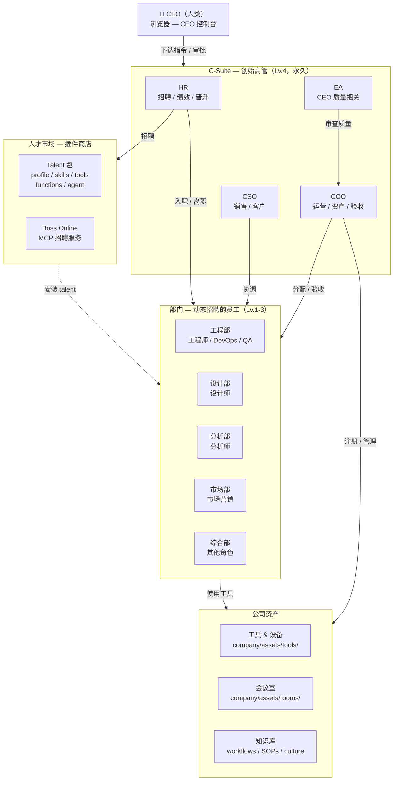
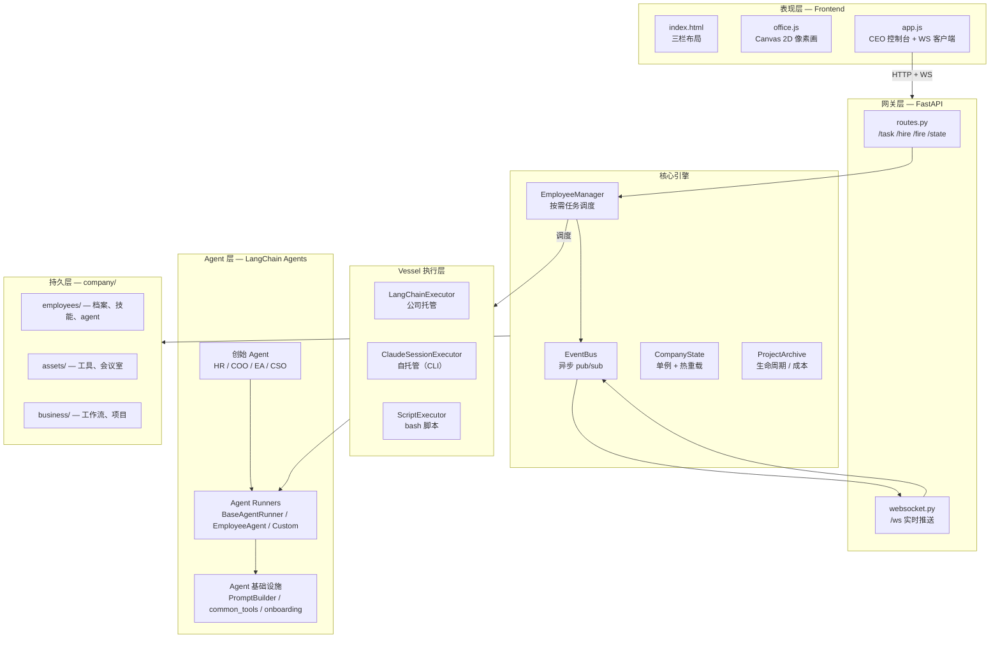
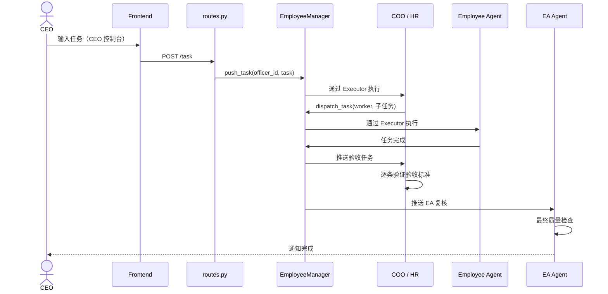

# 架构

> 面向开发者和贡献者的技术参考。

## 技术栈

- **后端**：Python 3.12+ / UV，FastAPI + WebSocket，LangChain（`create_react_agent`）
- **LLM**：OpenRouter API（每个员工可独立配置），Anthropic API（OAuth / API Key）
- **前端**：原生 JS + Canvas 2D 像素画（零构建工具）
- **基础设施**：Docker 沙箱，MCP 服务器，Watchdog 热重载
- **数据**：YAML 档案 + Markdown 工作流 + JSON 项目归档（git-friendly，无数据库依赖）

## 架构概览

## 系统分层

## 运转模式

### 模式 A：CEO 驱动 — 内部经营

### 模式 B：互联网任务单 — 对外接单（规划中）

外部客户通过 Sales API 提交任务 → CSO 评估 → 内部团队交付。公司作为服务商运转。

## 模块索引

| 层级 | 模块 | 职责 |
|------|------|------|
| **入口** | `main.py` | FastAPI 应用，生命周期 |
| **API** | `routes.py` | REST 端点 |
| **API** | `websocket.py` | WS 实时推送 |
| **Agents** | `base.py` | `BaseAgentRunner`、`EmployeeAgent` |
| **Agents** | `hr_agent.py` | 招聘、绩效、晋升 |
| **Agents** | `coo_agent.py` | 运营、资产、验收 |
| **Agents** | `ea_agent.py` | CEO 质量把关 |
| **Agents** | `cso_agent.py` | 销售管线 |
| **Agents** | `common_tools.py` | 共享工具（dispatch、meeting、文件操作） |
| **Agents** | `prompt_builder.py` | 可组合提示词系统 |
| **Agents** | `onboarding.py` | 入职流程 + talent 安装 |
| **Agents** | `termination.py` | 离职流程 + 清理 |
| **Core** | `config.py` | 路径、常量、配置加载器 |
| **Core** | `state.py` | `CompanyState` 单例、热重载 |
| **Core** | `events.py` | 异步 `EventBus` pub/sub |
| **Core** | `vessel.py` | `Vessel`、`EmployeeManager`、`Executor` 协议 |
| **Core** | `vessel_config.py` | `VesselConfig`（DNA）加载/保存/迁移 |
| **Core** | `vessel_harness.py` | 6 类 Harness 协议 |
| **Core** | `routine.py` | 任务后工作流调度 |
| **Core** | `workflow_engine.py` | Markdown → `WorkflowDefinition` |
| **Core** | `project_archive.py` | 项目 CRUD、成本追踪 |
| **Core** | `layout.py` | 办公室网格分配 |
| **Talent** | `talent_spec.py` | `TalentPackage`、`AgentManifest` |
| **Talent** | `boss_online.py` | MCP 招聘服务 |
| **Infra** | `tools/sandbox/` | Docker 代码执行 |
| **Infra** | `claude_session.py` | Claude CLI 会话管理 |
| **Frontend** | `index.html` | 三栏布局 |
| **Frontend** | `office.js` | Canvas 2D 像素画渲染 |
| **Frontend** | `app.js` | CEO 控制台、WebSocket 处理 |

## 设计哲学

1. **系统性设计，不打补丁** — 每个变更都是结构性的，不写 `if id == "特殊情况"`
2. **Registry/Dispatch 优于 if-elif** — 数据驱动的模式
3. **完整数据包** — 每个状态都可序列化、可恢复、有注册、有终结
4. **禁止静默异常** — 必须 log，必须 re-raise `CancelledError`
5. **磁盘即唯一真相源** — 业务数据不做内存缓存
6. **零空转** — 没有 `while True` 轮询，事件驱动，按需执行
7. **Git-Friendly 持久化** — YAML + Markdown + JSON，可 `git diff`、`git blame`、`git revert`
8. **最小复杂度** — 三行重复代码好过一个过早的抽象
