# Task Lifecycle 分析

> 现状流程图已固定在 [2026-03-15-task-lifecycle-current.md](2026-03-15-task-lifecycle-current.md)，不再修改。

---

## 问题清单

### Issue 1: 取消 simple task_type，所有任务统一为 project

**CEO 决定**：删除 `task_type` 字段的 `"simple"` 值。所有任务节点统一按 project 处理，执行完停在 `completed`，等待上级 review 后才能 `accepted → finished`。

**现状问题**：
- `TaskNode.task_type` 默认值 `"simple"` 导致所有节点 auto-skip review
- EA 节点是 simple → 先于子任务 finished → 子任务完成后 `_on_child_complete` 跳过 → review 永远不触发
- simple/project 两条路径增加了系统复杂度，且 simple 路径实际上绕过了质量管控

**解决方案**：
- 删除 `task_type` 字段（或硬编码为 `"project"`）
- 删除 auto-skip 逻辑（`vessel.py:1085-1087` 的 `if task_type == "simple"` 分支）
- 所有节点执行完 → `completed` → 等父节点 review → `accepted` → `finished`
- CEO root 和 review node 等系统节点用 `node_type` 区分行为，不依赖 `task_type`

**前端变更**：
- 删除 `project-select` 下拉中的 "Simple Task" / "Create New Project" 区分
- CEO 只需输入任务描述，不需要选择任务类型
- 项目名称由 EA 第一次收到 CEO 请求后自动生成，之后不再自动修改
- CEO 可在 project 详情页手动修改项目名称

### Issue 2: fail_strategy="continue" 无实际使用场景，应移除

**问题**：`TaskNode.fail_strategy` 支持 `"block"` 和 `"continue"` 两个值，但 `"continue"` 从未被使用过。保留这个分支增加了依赖解析的复杂度，且语义不明确（前置失败了还继续执行，结果如何保证？）。

**解决方案**：
- 移除 `fail_strategy` 字段，依赖失败时统一走 block/cascade cancel 逻辑
- 修复后的流程图中去掉 continue 分支

### Issue 3: 项目上下文中的任务绕过任务树，用 adhoc 创建独立任务

**问题**：`_push_adhoc_task` 在员工 `tasks/` 目录下创建独立的一次性任务树。当在项目执行上下文中调用时，工作成果不会回流到项目任务树，项目树中的对应节点状态不更新。

**例子**：
1. EA 在项目树中 dispatch_child 给 HR 做招聘（项目树节点 `04eb125ce2d9`）
2. COO 在执行项目任务时调用 `request_hiring()` → 内部调 `_push_adhoc_task(HR_ID, jd)` 创建了**独立的** HR 任务
3. HR 实际执行的是 adhoc 任务，不是项目树里的节点
4. batch-hire 完成后 resume 的也是 adhoc 任务的 batch_id
5. 项目树里 HR 节点 `04eb125ce2d9` 的 `batch_id=f929d67d` 从未被消费 → 永远卡在 holding

**涉及的 adhoc 调用（应改为 dispatch_child）**：

| 位置 | 当前行为 | 应改为 |
|------|---------|--------|
| `coo_agent.py:850` — `request_hiring` → HR | 创建独立 HR adhoc 任务 | COO 通过 dispatch_child 在项目树中创建 HR 子节点 |
| `routes.py:3651` — hire-ready → COO follow-up | 创建独立 COO adhoc 任务 | resume COO 在项目树中的 HOLDING 节点 |
| `routes.py:4059` — batch-hire → COO 分配部门 | 创建独立 COO adhoc 任务 | 同上，作为 COO HOLDING 恢复后的继续执行 |

**不需要改的 adhoc 调用（确实没有任务树上下文）**：

| 位置 | 场景 | 原因 |
|------|------|------|
| `routes.py:1045` | CEO 预约会议室 → COO | CEO UI 触发，无任务树 |
| `routes.py:1246` | 季度绩效评审 → HR | 系统 API 触发，无任务树 |
| `routes.py:4731` | 外包合同 → CSO 审核 | 外部 API 触发，无任务树 |

### Issue 4: 非 EA 员工不知道什么时候该向 CEO 上报

**问题**：`base.py` 共享 prompt 只有一句 `Use dispatch_child("00001", description) to escalate issues to CEO`，没有具体场景指导。除 EA 外，COO/HR/CSO/普通员工不知道什么情况该调用这个能力。遇到需要系统外操作（购买 API、申请权限、签合同等）时，更可能自己硬做或卡住，而不是上报 CEO。

**现状各员工的 CEO 上报认知**：

| 员工 | 知道什么 | 缺什么 |
|------|---------|--------|
| EA | 详细列了：财务、人事、对外承诺、模糊需求 → 上报 CEO | 完整 |
| COO | 招聘走 request_hiring、会议室要 CEO 授权 | 缺通用上报场景（购买、权限、系统外操作） |
| HR | shortlist 交 CEO，不能直接招人 | 缺通用上报场景 |
| CSO | 无 | 完全缺失 |
| 普通员工 | 只有 base.py 一句话 | 完全缺失 |

**解决方案**：
- 在 `base.py` 共享 prompt 中扩充 CEO 上报指导，列出通用场景：
  - 需要购买/付费（API key、SaaS 订阅、域名等）
  - 需要系统外操作（人工审批、签合同、法律合规）
  - 需要创建/获取外部账号或权限
  - 任务超出自身能力范围且无法委派给其他员工
  - 涉及公司对外承诺或品牌形象
- 各 O-level agent 可补充角色特定的上报场景

### Issue 5: Task Queue 改为展示正在执行的 task node

**问题**：前端 task queue 面板目前展示的是 adhoc simple task 列表，取消 simple task 后该面板失去意义。

**解决方案**：
- Task queue 改为展示所有状态为 `processing` 的 task node（来自各项目树）
- 每个卡片显示：员工名、任务描述、所属项目、运行时长
- 点击卡片 → 打开对应项目的任务树，并自动选中该 task node

---

## 修复后的 Task Lifecycle 决策树

```mermaid
flowchart TD
    %% ========== 1. 任务创建 ==========

    BIRTH(["任务节点诞生"]) --> HOW{"创建方式?"}

    HOW -->|"CEO 下发任务"| CEO_CREATE["创建任务树<br/>CEO root (ceo_prompt)<br/>└── EA child node"]
    HOW -->|"员工执行中需要委派"| DISPATCH_DECIDE{"当前有<br/>project_dir?"}
    HOW -->|"系统/API 触发<br/>(无任务树上下文)"| ADHOC_CREATE["_push_adhoc_task<br/>创建独立任务树"]

    DISPATCH_DECIDE -->|Yes| DC_CREATE["dispatch_child()<br/>在项目树中创建子节点"]
    DISPATCH_DECIDE -->|No| ADHOC_CREATE

    %% ========== 1a. CEO → EA ==========

    CEO_CREATE --> EA_EXEC["EA 分析 CEO 需求<br/>自动生成项目名称<br/>(CEO 可在详情页修改)"]
    EA_EXEC --> EA_ACTION{"EA 执行"}
    EA_ACTION -->|"自己能完成"| EA_DIRECT["EA 直接输出结果"]
    EA_ACTION -->|"需要委派"| EA_DISPATCH["EA dispatch_child<br/>给 O-level"]

    EA_DIRECT --> EXEC_DONE
    EA_DISPATCH --> INIT_PENDING

    %% ========== 1b. 特殊场景：招聘流程 ==========

    DC_CREATE --> IS_HIRING{"子任务涉及<br/>招聘?"}
    IS_HIRING -->|No| INIT_PENDING["status = pending"]
    IS_HIRING -->|Yes| HIRING_CHILD["dispatch_child(HR)<br/>HR 子节点在项目树中<br/>COO 自身 → holding<br/>(等待招聘结果)"]
    HIRING_CHILD --> INIT_PENDING

    ADHOC_CREATE --> INIT_PENDING

    %% ========== 2. 等待调度 ==========

    INIT_PENDING --> HAS_DEPS{"有 depends_on?"}
    HAS_DEPS -->|No| SCHEDULE_NOW["schedule_node<br/>加入员工调度队列"]
    HAS_DEPS -->|Yes| WAIT_DEPS["等待前置依赖完成<br/>(由 _resolve_dependencies 唤醒)"]

    WAIT_DEPS --> DEP_EVENT(["前置节点状态变更"])
    DEP_EVENT --> DEP_FAILED{"任一前置<br/>∈ WILL_NOT_DELIVER?"}

    DEP_FAILED -->|No| DEP_ALL_RESOLVED{"所有前置<br/>∈ RESOLVED?"}
    DEP_ALL_RESOLVED -->|No| WAIT_DEPS
    DEP_ALL_RESOLVED -->|Yes| SCHEDULE_NOW

    DEP_FAILED -->|Yes| DEP_IS_CANCELLED{"前置是 cancelled?"}
    DEP_IS_CANCELLED -->|No| TO_BLOCKED["status → blocked"]
    DEP_IS_CANCELLED -->|Yes| TO_CASCADE_CANCEL["status → cancelled<br/>(cascade cancel)"]
    TO_CASCADE_CANCEL --> TERMINAL_CANCELLED(["CANCELLED 终态"])
    TO_BLOCKED --> BLOCKED_WAIT(["等待人工处理<br/>unblock_child / cancel_child"])

    %% ========== 3. 调度执行 ==========

    SCHEDULE_NOW --> SCHEDULE_NEXT["_schedule_next"]
    SCHEDULE_NEXT --> EMPLOYEE_BUSY{"员工正在<br/>执行其他任务?"}
    EMPLOYEE_BUSY -->|Yes| QUEUE["排队等待<br/>前一任务结束后自动调度"]
    EMPLOYEE_BUSY -->|No| RUN_TASK["_run_task → _execute_task"]

    QUEUE --> PREV_DONE(["前一任务结束"]) --> RUN_TASK

    RUN_TASK --> SET_PROCESSING["status → processing<br/>员工状态 → working"]
    SET_PROCESSING --> AGENT_RUN["Agent/Executor 执行任务<br/>(LangChain / Claude CLI / Script)"]

    %% ========== 4. 执行期间 ==========

    AGENT_RUN --> AGENT_ACTION{"Agent 行为"}
    AGENT_ACTION -->|"正常输出结果"| EXEC_DONE["执行结束"]
    AGENT_ACTION -->|"dispatch_child()"| SPAWN_CHILD["创建子任务节点<br/>(回到 DISPATCH_DECIDE)"]
    SPAWN_CHILD --> AGENT_RUN
    AGENT_ACTION -->|"执行异常/超时"| TO_FAILED["status → failed"]
    AGENT_ACTION -->|"输出 __HOLDING:..."| EXEC_DONE

    %% ========== 5. 执行结束后判断 ==========

    EXEC_DONE --> ALREADY_FAILED{"已被标记<br/>failed/cancelled?"}
    ALREADY_FAILED -->|Yes| POST_TASK["进入收尾流程"]
    ALREADY_FAILED -->|No| HOLDING_CHECK{"result 含<br/>__HOLDING 标记?"}

    HOLDING_CHECK -->|Yes| TO_HOLDING["status → holding<br/>启动 watchdog cron<br/>(定时检查超时)"]
    HOLDING_CHECK -->|No| TO_COMPLETED["status → completed<br/>等待上级 review"]

    TO_COMPLETED --> POST_TASK

    %% ========== 6. HOLDING 等待与恢复 ==========

    TO_HOLDING --> HOLDING_EVENT(["外部事件触发<br/>(招聘完成 / 审批通过 / ...)"])
    HOLDING_EVENT --> RESUME["resume_held_task(result)<br/>必须 resume 项目树中的节点<br/>不能创建新 adhoc 任务"]
    RESUME --> RESUME_COMPLETED["status → completed"]
    RESUME_COMPLETED --> POST_TASK

    %% ========== 7. 收尾：向上传播 ==========

    POST_TASK --> IN_PROJECT{"在项目任务树中?<br/>(有 project_dir)"}
    IN_PROJECT -->|No| UNSCHEDULE["unschedule<br/>_schedule_next<br/>执行下一个排队任务"]
    IN_PROJECT -->|Yes| PROPAGATE["触发向上传播<br/>_on_child_complete<br/>+ _trigger_dep_resolution"]

    PROPAGATE --> IS_CEO_CHILD{"parent 是<br/>CEO node?"}
    IS_CEO_CHILD -->|Yes| CEO_INBOX["parent → completed<br/>写入 CEO inbox<br/>等待 CEO 确认"]
    IS_CEO_CHILD -->|No| PARENT_STATUS{"parent ∈ RESOLVED?"}

    PARENT_STATUS -->|Yes| PROPAGATE_SKIP["跳过<br/>parent 已关闭"]
    PARENT_STATUS -->|No| CHILDREN_CHECK{"all_children_done?<br/>(所有子任务 ∈ DONE_EXECUTING)"}

    CHILDREN_CHECK -->|No| WAIT_SIBLINGS["等待兄弟任务完成"]
    CHILDREN_CHECK -->|Yes| REVIEW_EXISTS{"已有 active<br/>review node?"}

    REVIEW_EXISTS -->|Yes| SKIP_DUP["跳过, 避免重复"]
    REVIEW_EXISTS -->|No| ALL_ACCEPTED{"所有非 review 子任务<br/>都 accepted?"}

    ALL_ACCEPTED -->|Yes| PARENT_AUTO_COMPLETE["父节点 auto-complete<br/>→ completed<br/>递归回到 POST_TASK"]
    ALL_ACCEPTED -->|No| REVIEW_LIMIT{"review 轮数 ≥ 上限?"}

    REVIEW_LIMIT -->|Yes| ESCALATE_CEO["创建 ceo_request 节点<br/>上报 CEO 介入"]
    REVIEW_LIMIT -->|No| SPAWN_REVIEW["创建 review node<br/>分配给父节点 employee"]

    %% ========== 8. Review 执行 ==========

    SPAWN_REVIEW --> REVIEW_SCHEDULED["review node<br/>pending → schedule → processing"]
    REVIEW_SCHEDULED --> REVIEWER_RUN["父 employee 执行审核"]
    REVIEWER_RUN --> REVIEW_DECISION{"对每个子任务<br/>accept / reject ?"}

    REVIEW_DECISION -->|"accept_child(id)"| CHILD_TO_ACCEPTED["子任务 → accepted"]
    REVIEW_DECISION -->|"reject_child(id, reason)"| CHILD_TO_FAILED["子任务 → failed"]
    REVIEW_DECISION -->|"dispatch_child()"| NEW_SUBTASK["追加新子任务"]

    CHILD_TO_FAILED --> RETRY{"重试?"}
    RETRY -->|Yes| CHILD_RETRY["子任务 → processing<br/>重新执行"]
    CHILD_RETRY --> AGENT_RUN
    RETRY -->|No| TO_FAILED

    CHILD_TO_ACCEPTED --> REVIEW_DONE["review node 自身完成"]
    REVIEW_DONE --> CHILDREN_CHECK

    %% ========== 9. 终态 ==========

    TO_FAILED --> FAILED_RETRY{"可重试?<br/>(未超重试上限)"}
    FAILED_RETRY -->|Yes| BACK_PROCESSING["status → processing<br/>重新执行"]
    BACK_PROCESSING --> AGENT_RUN
    FAILED_RETRY -->|No| TERMINAL_FAILED(["FAILED 终态"])

    CEO_INBOX --> CEO_DECIDE(["CEO 确认"])
    CEO_DECIDE --> TERMINAL_FINISHED

    PROPAGATE_SKIP --> UNSCHEDULE
    WAIT_SIBLINGS --> UNSCHEDULE
    SKIP_DUP --> UNSCHEDULE

    PARENT_AUTO_COMPLETE -.-> POST_TASK

    UNSCHEDULE --> TERMINAL_FINISHED(["FINISHED 终态"])

    %% ========== Styles ==========

    style BIRTH fill:#333,color:#fff
    style HOLDING_EVENT fill:#333,color:#fff
    style DEP_EVENT fill:#333,color:#fff
    style PREV_DONE fill:#333,color:#fff
    style CEO_DECIDE fill:#333,color:#fff

    style TERMINAL_FINISHED fill:#00cc66,color:#fff
    style TERMINAL_CANCELLED fill:#888,color:#fff
    style TERMINAL_FAILED fill:#ff4444,color:#fff

    style TO_COMPLETED fill:#ffaa00,color:#333
    style TO_HOLDING fill:#9966cc,color:#fff
    style SPAWN_REVIEW fill:#66cc66,color:#fff
    style PARENT_AUTO_COMPLETE fill:#66cc66,color:#fff
    style CEO_INBOX fill:#ffd700,color:#333
    style ESCALATE_CEO fill:#ffd700,color:#333
    style TO_FAILED fill:#ff4444,color:#fff
    style TO_BLOCKED fill:#ff4444,color:#fff
    style TO_CASCADE_CANCEL fill:#ff4444,color:#fff
    style SCHEDULE_NOW fill:#4a9eff,color:#fff
    style DISPATCH_DECIDE fill:#ff9900,color:#fff
    style IS_HIRING fill:#ff9900,color:#fff
    style RESUME fill:#9966cc,color:#fff
    style EA_ACTION fill:#ff9900,color:#fff
```

### 修复后与现状的关键差异

| # | 现状 | 修复后 |
|---|------|--------|
| 1 | `task_type` 有 simple/project 两种，默认 simple → auto-skip review | **删除 task_type**，所有节点统一 completed → 等 review → accepted → finished |
| 2 | 前端区分 Simple Task / Create New Project / Q&A | 前端只保留任务输入框 + Q&A 模式，EA 自动生成项目名 |
| 3 | EA 先于子任务 finished → review 永远不触发 | EA completed 后等待子任务 → 子任务完成后正常触发 review |
| 4 | 项目内委派用 `_push_adhoc_task` → 脱离任务树 | 有 project_dir 时**必须**用 `dispatch_child` → 留在任务树 |
| 5 | 招聘回调创建新 adhoc COO 任务 | 招聘回调 `resume_held_task` 恢复项目树中 COO 的 HOLDING 节点 |

---

## 状态集合速查

| 集合 | 成员 | 语义 |
|------|------|------|
| **RESOLVED** | accepted, finished, failed, cancelled | 已决，可用于解锁依赖判断 |
| **DONE_EXECUTING** | completed, accepted, finished, failed, cancelled | 已停止执行，用于 all_children_done |
| **UNBLOCKS_DEPENDENTS** | accepted, finished | 成功完成，解锁后序 |
| **WILL_NOT_DELIVER** | failed, blocked, cancelled | 不会产出结果 |
| **TERMINAL** | finished, cancelled | 绝对终态，不可转移 |

## 需要删除/修改的代码

| 位置 | 改动 |
|------|------|
| `task_tree.py:47` | 删除 `task_type` 字段或硬编码为 `"project"` |
| `vessel.py:1085-1087` | 删除 `if task_type == "simple"` auto-skip 分支 |
| `vessel.py:1206` | 同上，`resume_held_task` 中的 auto-skip |
| `tree_tools.py:225` | 不再需要设 `child.task_type = "project"`（字段已删） |
| `ea_agent.py:63-67` | 删除 Simple vs Project 区分的 prompt 段落 |
| `task_lifecycle.py` | 如删除字段，清理相关文档常量 |
| `frontend/index.html:86-93` | 删除 project-select 下拉，简化为纯输入框 |
| `frontend/app.js:5069-5077` | 删除项目选择逻辑 |
| `routes.py:604-614` | EA 节点不再需要设 task_type |
| EA prompt | 新增：自动生成项目名称的指令 |
| 前端 project 详情页 | 新增：CEO 可编辑项目名称 |
