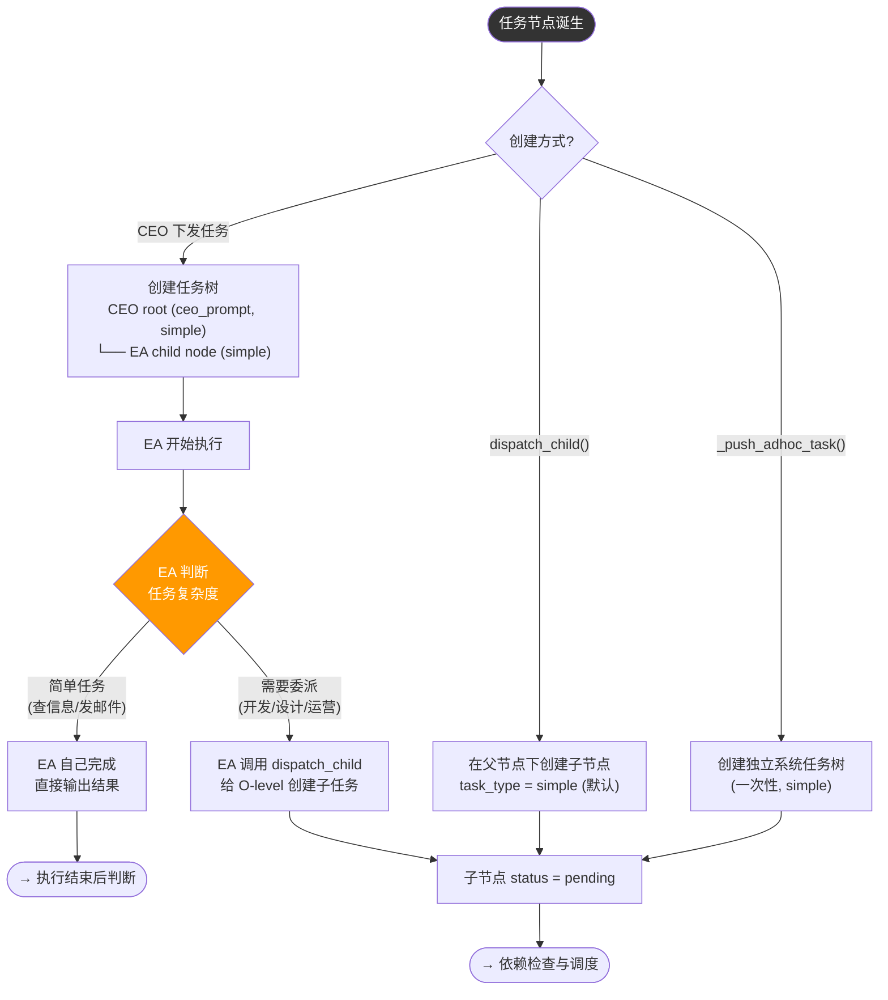
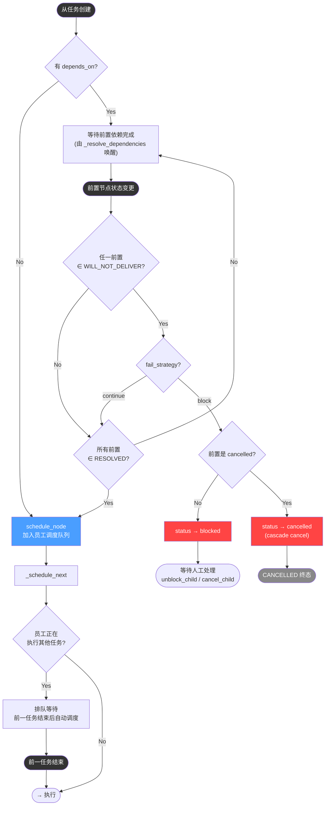
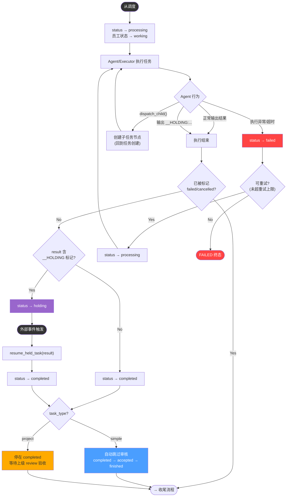
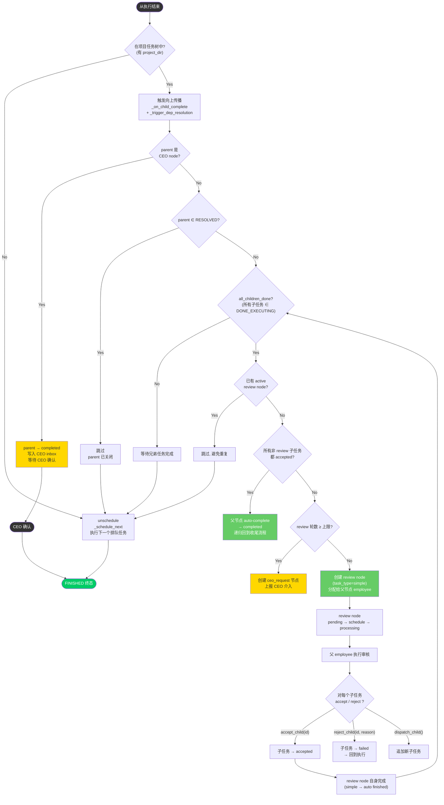

# Task Lifecycle 现状决策树（修复前）

## 1. 任务创建

```mermaid
flowchart TD
    BIRTH(["任务节点诞生"]) --> HOW{"创建方式?"}

    HOW -->|"CEO 下发任务"| CEO_CREATE["创建任务树<br/>CEO root (ceo_prompt, simple)<br/>└── EA child node (simple)"]
    HOW -->|"dispatch_child()"| DC_CREATE["在父节点下创建子节点<br/>task_type = simple (默认)"]
    HOW -->|"_push_adhoc_task()"| ADHOC_CREATE["创建独立系统任务树<br/>(一次性, simple)"]

    CEO_CREATE --> EA_EXEC["EA 开始执行"]
    EA_EXEC --> EA_DECIDE{"EA 判断<br/>任务复杂度"}
    EA_DECIDE -->|"简单任务<br/>(查信息/发邮件)"| EA_DIRECT["EA 自己完成<br/>直接输出结果"]
    EA_DECIDE -->|"需要委派<br/>(开发/设计/运营)"| EA_DISPATCH["EA 调用 dispatch_child<br/>给 O-level 创建子任务"]

    EA_DIRECT --> TO_EXEC(["→ 执行结束后判断"])
    EA_DISPATCH --> TO_PENDING["子节点 status = pending"]
    DC_CREATE --> TO_PENDING
    ADHOC_CREATE --> TO_PENDING

    TO_PENDING --> TO_DEP(["→ 依赖检查与调度"])

    style BIRTH fill:#333,color:#fff
    style EA_DECIDE fill:#ff9900,color:#fff
```

## 2. 依赖检查与调度

```mermaid
flowchart TD
    FROM_CREATE(["从任务创建"]) --> HAS_DEPS{"有 depends_on?"}
    HAS_DEPS -->|No| SCHEDULE_NOW["schedule_node<br/>加入员工调度队列"]
    HAS_DEPS -->|Yes| WAIT_DEPS["等待前置依赖完成<br/>(由 _resolve_dependencies 唤醒)"]

    WAIT_DEPS --> DEP_EVENT(["前置节点状态变更"])
    DEP_EVENT --> DEP_FAILED{"任一前置<br/>∈ WILL_NOT_DELIVER?"}

    DEP_FAILED -->|No| DEP_ALL_RESOLVED{"所有前置<br/>∈ RESOLVED?"}
    DEP_ALL_RESOLVED -->|No| WAIT_DEPS
    DEP_ALL_RESOLVED -->|Yes| SCHEDULE_NOW

    DEP_FAILED -->|Yes| DEP_FAIL_STRATEGY{"fail_strategy?"}
    DEP_FAIL_STRATEGY -->|continue| DEP_ALL_RESOLVED
    DEP_FAIL_STRATEGY -->|block| DEP_IS_CANCELLED{"前置是 cancelled?"}
    DEP_IS_CANCELLED -->|No| TO_BLOCKED["status → blocked"]
    DEP_IS_CANCELLED -->|Yes| TO_CASCADE_CANCEL["status → cancelled<br/>(cascade cancel)"]

    TO_CASCADE_CANCEL --> TERMINAL_CANCELLED(["CANCELLED 终态"])
    TO_BLOCKED --> BLOCKED_WAIT(["等待人工处理<br/>unblock_child / cancel_child"])

    SCHEDULE_NOW --> SCHEDULE_NEXT["_schedule_next"]
    SCHEDULE_NEXT --> EMPLOYEE_BUSY{"员工正在<br/>执行其他任务?"}
    EMPLOYEE_BUSY -->|Yes| QUEUE["排队等待<br/>前一任务结束后自动调度"]
    EMPLOYEE_BUSY -->|No| TO_EXEC(["→ 执行"])

    QUEUE --> PREV_DONE(["前一任务结束"]) --> TO_EXEC

    style FROM_CREATE fill:#333,color:#fff
    style DEP_EVENT fill:#333,color:#fff
    style PREV_DONE fill:#333,color:#fff
    style TERMINAL_CANCELLED fill:#888,color:#fff
    style SCHEDULE_NOW fill:#4a9eff,color:#fff
    style TO_BLOCKED fill:#ff4444,color:#fff
    style TO_CASCADE_CANCEL fill:#ff4444,color:#fff
```

## 3. 执行与结果判断

```mermaid
flowchart TD
    RUN_TASK(["从调度"]) --> SET_PROCESSING["status → processing<br/>员工状态 → working"]
    SET_PROCESSING --> AGENT_RUN["Agent/Executor 执行任务"]

    AGENT_RUN --> AGENT_ACTION{"Agent 行为"}
    AGENT_ACTION -->|"正常输出结果"| EXEC_DONE["执行结束"]
    AGENT_ACTION -->|"dispatch_child()"| SPAWN_CHILD["创建子任务节点<br/>(回到任务创建)"]
    SPAWN_CHILD --> AGENT_RUN
    AGENT_ACTION -->|"执行异常/超时"| TO_FAILED["status → failed"]
    AGENT_ACTION -->|"输出 __HOLDING:..."| EXEC_DONE

    EXEC_DONE --> ALREADY_FAILED{"已被标记<br/>failed/cancelled?"}
    ALREADY_FAILED -->|Yes| POST_TASK(["→ 收尾流程"])
    ALREADY_FAILED -->|No| HOLDING_CHECK{"result 含<br/>__HOLDING 标记?"}

    HOLDING_CHECK -->|Yes| TO_HOLDING["status → holding"]
    HOLDING_CHECK -->|No| TO_COMPLETED["status → completed"]

    TO_COMPLETED --> TASK_TYPE{"task_type?"}
    TASK_TYPE -->|simple| AUTO_SKIP["自动跳过审核<br/>completed → accepted → finished"]
    TASK_TYPE -->|project| STAY_COMPLETED["停在 completed<br/>等待上级 review 验收"]

    AUTO_SKIP --> POST_TASK
    STAY_COMPLETED --> POST_TASK

    TO_HOLDING --> HOLDING_EVENT(["外部事件触发"])
    HOLDING_EVENT --> RESUME["resume_held_task(result)"]
    RESUME --> RESUME_COMPLETED["status → completed"]
    RESUME_COMPLETED --> TASK_TYPE

    TO_FAILED --> FAILED_RETRY{"可重试?<br/>(未超重试上限)"}
    FAILED_RETRY -->|Yes| BACK_PROCESSING["status → processing"]
    BACK_PROCESSING --> AGENT_RUN
    FAILED_RETRY -->|No| TERMINAL_FAILED(["FAILED 终态"])

    style RUN_TASK fill:#333,color:#fff
    style HOLDING_EVENT fill:#333,color:#fff
    style AUTO_SKIP fill:#4a9eff,color:#fff
    style STAY_COMPLETED fill:#ffaa00,color:#333
    style TO_HOLDING fill:#9966cc,color:#fff
    style TO_FAILED fill:#ff4444,color:#fff
    style TERMINAL_FAILED fill:#ff4444,color:#fff
```

## 4. 收尾：向上传播与 Review

```mermaid
flowchart TD
    POST_TASK(["从执行结束"]) --> IN_PROJECT{"在项目任务树中?<br/>(有 project_dir)"}
    IN_PROJECT -->|No| UNSCHEDULE["unschedule<br/>_schedule_next<br/>执行下一个排队任务"]
    IN_PROJECT -->|Yes| PROPAGATE["触发向上传播<br/>_on_child_complete<br/>+ _trigger_dep_resolution"]

    PROPAGATE --> IS_CEO_CHILD{"parent 是<br/>CEO node?"}
    IS_CEO_CHILD -->|Yes| CEO_INBOX["parent → completed<br/>写入 CEO inbox<br/>等待 CEO 确认"]
    IS_CEO_CHILD -->|No| PARENT_STATUS{"parent ∈ RESOLVED?"}

    PARENT_STATUS -->|Yes| PROPAGATE_SKIP["跳过<br/>parent 已关闭"]
    PARENT_STATUS -->|No| CHILDREN_CHECK{"all_children_done?<br/>(所有子任务 ∈ DONE_EXECUTING)"}

    CHILDREN_CHECK -->|No| WAIT_SIBLINGS["等待兄弟任务完成"]
    CHILDREN_CHECK -->|Yes| REVIEW_EXISTS{"已有 active<br/>review node?"}

    REVIEW_EXISTS -->|Yes| SKIP_DUP["跳过, 避免重复"]
    REVIEW_EXISTS -->|No| ALL_ACCEPTED{"所有非 review 子任务<br/>都 accepted?"}

    ALL_ACCEPTED -->|Yes| PARENT_AUTO_COMPLETE["父节点 auto-complete<br/>→ completed<br/>递归回到收尾流程"]
    ALL_ACCEPTED -->|No| REVIEW_LIMIT{"review 轮数 ≥ 上限?"}

    REVIEW_LIMIT -->|Yes| ESCALATE_CEO["创建 ceo_request 节点<br/>上报 CEO 介入"]
    REVIEW_LIMIT -->|No| SPAWN_REVIEW["创建 review node<br/>(task_type=simple)<br/>分配给父节点 employee"]

    SPAWN_REVIEW --> REVIEW_SCHEDULED["review node<br/>pending → schedule → processing"]
    REVIEW_SCHEDULED --> REVIEWER_RUN["父 employee 执行审核"]
    REVIEWER_RUN --> REVIEW_DECISION{"对每个子任务<br/>accept / reject ?"}

    REVIEW_DECISION -->|"accept_child(id)"| CHILD_TO_ACCEPTED["子任务 → accepted"]
    REVIEW_DECISION -->|"reject_child(id, reason)"| CHILD_TO_FAILED["子任务 → failed<br/>→ 回到执行"]
    REVIEW_DECISION -->|"dispatch_child()"| NEW_SUBTASK["追加新子任务"]

    CHILD_TO_ACCEPTED --> REVIEW_DONE["review node 自身完成<br/>(simple → auto finished)"]
    REVIEW_DONE --> CHILDREN_CHECK

    CEO_INBOX --> CEO_DECIDE(["CEO 确认"])
    CEO_DECIDE --> TERMINAL_FINISHED

    PROPAGATE_SKIP --> UNSCHEDULE
    WAIT_SIBLINGS --> UNSCHEDULE
    SKIP_DUP --> UNSCHEDULE

    UNSCHEDULE --> TERMINAL_FINISHED(["FINISHED 终态"])

    style POST_TASK fill:#333,color:#fff
    style CEO_DECIDE fill:#333,color:#fff
    style TERMINAL_FINISHED fill:#00cc66,color:#fff
    style SPAWN_REVIEW fill:#66cc66,color:#fff
    style PARENT_AUTO_COMPLETE fill:#66cc66,color:#fff
    style CEO_INBOX fill:#ffd700,color:#333
    style ESCALATE_CEO fill:#ffd700,color:#333
```
