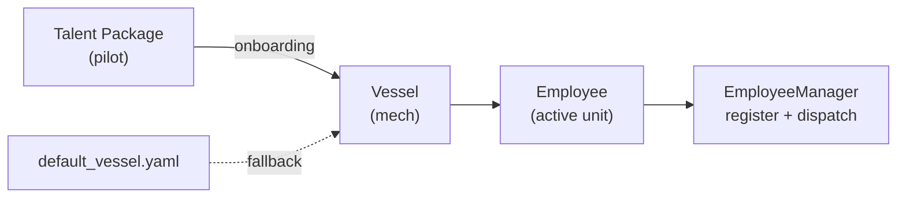

# Vessel + Talent System

> Deep dive into the modular agent architecture.

## Employee Directory Structure

```
employees/00010/
├── profile.yaml          # Employee profile
├── vessel/               # Vessel DNA
│   ├── vessel.yaml       # Config: runner / hooks / limits / capabilities
│   └── prompt_sections/  # Prompt fragments
├── skills/               # Talent — skills
└── progress.log          # Working memory
```

## vessel.yaml — The DNA

| Field          | Purpose                                                              |
| -------------- | -------------------------------------------------------------------- |
| `runner`       | Neural system — custom runner module and class                       |
| `hooks`        | Lifecycle hooks — pre_task / post_task callbacks                     |
| `context`      | Context injection — prompt sections, progress log, task history      |
| `limits`       | Execution limits — retry count, timeout, subtask depth               |
| `capabilities` | Capability declarations — sandbox, file upload, WebSocket, image gen |

## Vessel Harness — 6 Connection Protocols

| Harness            | Responsibility                                   |
| ------------------ | ------------------------------------------------ |
| `ExecutionHarness` | Executor protocol (execute / is_ready)           |
| `TaskHarness`      | Task queue management (push / get_next / cancel) |
| `EventHarness`     | Logging and event publishing                     |
| `StorageHarness`   | Progress log and history persistence             |
| `ContextHarness`   | Prompt / context assembly                        |
| `LifecycleHarness` | Pre/post task hook invocation                    |

## Talent → Employee Flow


