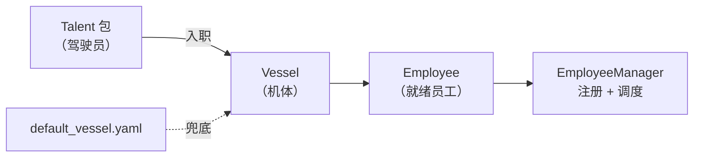

# Vessel + Talent 系统

> 模块化 Agent 架构深度解析。

## 员工目录结构

```
employees/00010/
├── profile.yaml          # 员工档案
├── vessel/               # 躯壳 DNA
│   ├── vessel.yaml       # 配置：runner / hooks / limits / capabilities
│   └── prompt_sections/  # 提示词片段
├── skills/               # 灵魂 — 技能
└── progress.log          # 工作记忆
```

## vessel.yaml — DNA 配置

| 字段 | 说明 |
|------|------|
| `runner` | 神经系统 — 自定义 runner 模块和类名 |
| `hooks` | 生命周期钩子 — pre_task / post_task 回调 |
| `context` | 上下文注入 — prompt sections、进度日志、任务历史 |
| `limits` | 执行限制 — 重试次数、超时、子任务深度 |
| `capabilities` | 能力声明 — sandbox、文件上传、WebSocket、图片生成 |

## Vessel Harness — 六类连接协议

| Harness | 职责 |
|---------|------|
| `ExecutionHarness` | 执行套接件 — Executor 协议（execute / is_ready） |
| `TaskHarness` | 任务套接件 — 任务队列管理（push / get_next / cancel） |
| `EventHarness` | 事件套接件 — 日志和事件发布 |
| `StorageHarness` | 存储套接件 — 进度日志和历史持久化 |
| `ContextHarness` | 上下文套接件 — prompt / context 组装 |
| `LifecycleHarness` | 生命周期套接件 — pre/post task 钩子调用 |

## Talent → Employee 流程


