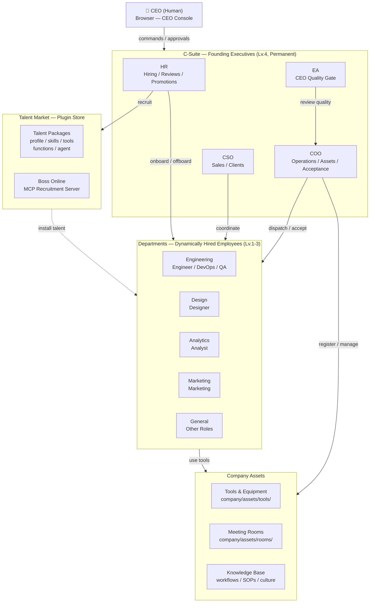
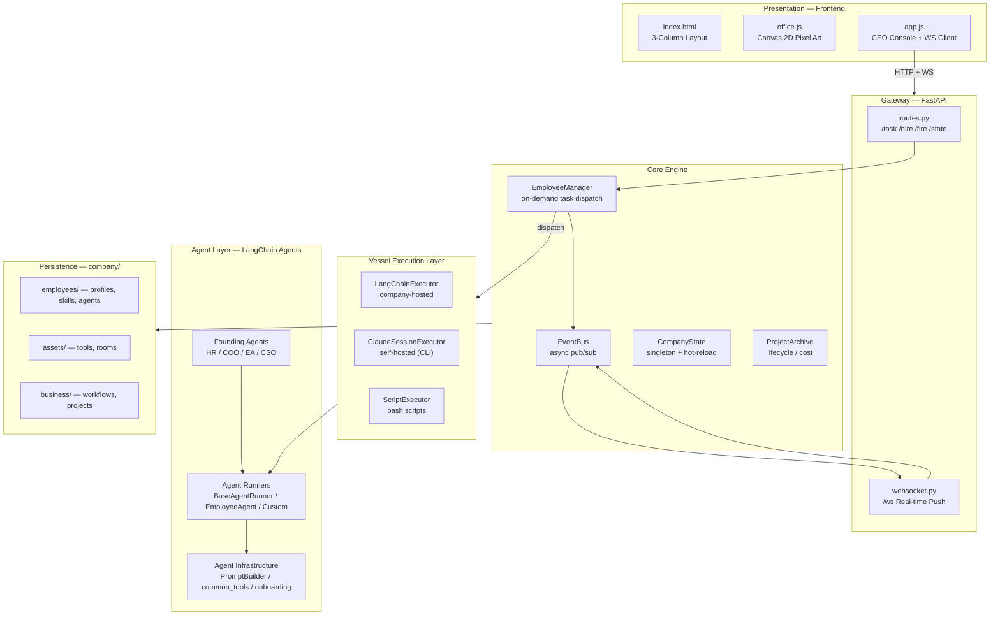
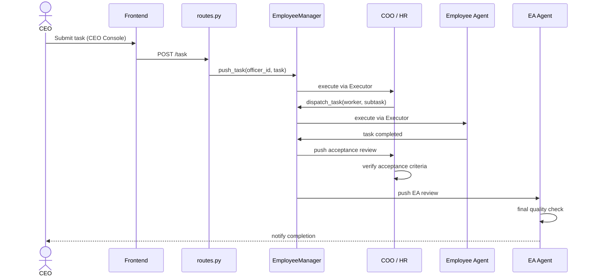

# Architecture

> Technical reference for developers and contributors.

## Tech Stack

- **Backend**: Python 3.12+ / UV, FastAPI + WebSocket, LangChain (`create_react_agent`)
- **LLM**: OpenRouter API (configurable per employee), Anthropic API (OAuth/API key)
- **Frontend**: Vanilla JS + Canvas 2D pixel art (zero build tools)
- **Infra**: Docker sandbox, MCP server, Watchdog hot-reload
- **Data**: YAML profiles + Markdown workflows + JSON project archives (git-friendly, no database)

## Architecture Overview

## System Layers

## Operating Modes

### Mode A: CEO-Driven — Internal Operations

### Mode B: Internet Task Orders — External Services (Planned)

External clients submit tasks via Sales API → CSO evaluates → internal team delivers. The company operates as a service provider.

## Module Index

| Layer        | Module               | Role                                             |
| ------------ | -------------------- | ------------------------------------------------ |
| **Entry**    | `main.py`            | FastAPI app, lifespan                            |
| **API**      | `routes.py`          | REST endpoints                                   |
| **API**      | `websocket.py`       | WS real-time push                                |
| **Agents**   | `base.py`            | `BaseAgentRunner`, `EmployeeAgent`               |
| **Agents**   | `hr_agent.py`        | Hiring, reviews, promotions                      |
| **Agents**   | `coo_agent.py`       | Operations, assets, acceptance                   |
| **Agents**   | `ea_agent.py`        | CEO quality gate                                 |
| **Agents**   | `cso_agent.py`       | Sales pipeline                                   |
| **Agents**   | `common_tools.py`    | Shared tools (dispatch, meeting, file ops)       |
| **Agents**   | `prompt_builder.py`  | Composable prompt system                         |
| **Agents**   | `onboarding.py`      | Hire flow + talent install                       |
| **Agents**   | `termination.py`     | Fire flow + cleanup                              |
| **Core**     | `config.py`          | Paths, constants, config loaders                 |
| **Core**     | `state.py`           | `CompanyState` singleton, hot-reload             |
| **Core**     | `events.py`          | Async `EventBus` pub/sub                         |
| **Core**     | `vessel.py`          | `Vessel`, `EmployeeManager`, `Executor` protocol |
| **Core**     | `vessel_config.py`   | `VesselConfig` (DNA) load/save/migrate           |
| **Core**     | `vessel_harness.py`  | 6 Harness protocols                              |
| **Core**     | `routine.py`         | Post-task workflow dispatch                      |
| **Core**     | `workflow_engine.py` | Markdown → `WorkflowDefinition`                  |
| **Core**     | `project_archive.py` | Project CRUD, cost tracking                      |
| **Core**     | `layout.py`          | Office grid allocation                           |
| **Talent**   | `talent_spec.py`     | `TalentPackage`, `AgentManifest`                 |
| **Talent**   | `boss_online.py`     | MCP recruitment server                           |
| **Infra**    | `tools/sandbox/`     | Docker code execution                            |
| **Infra**    | `claude_session.py`  | Claude CLI session management                    |
| **Frontend** | `index.html`         | 3-column layout                                  |
| **Frontend** | `office.js`          | Canvas 2D pixel art renderer                     |
| **Frontend** | `app.js`             | CEO console, WebSocket handler                   |

## Design Philosophy

1. **Systematic Design, Not Patching** — Every change is structural. No `if id == "special_case"`.
2. **Registry/Dispatch over if-elif** — Data-driven patterns everywhere.
3. **Complete Data Packages** — Every state is serializable, recoverable, registered, and terminable.
4. **No Silent Exceptions** — Always log. Always re-raise `CancelledError`.
5. **Disk = Single Source of Truth** — No in-memory caching of business data.
6. **Zero Idle** — No `while True` polling. Event-driven, on-demand execution.
7. **Git-Friendly Persistence** — YAML + Markdown + JSON. `git diff`, `git blame`, `git revert`.
8. **Minimal Complexity** — Three similar lines > premature abstraction.
